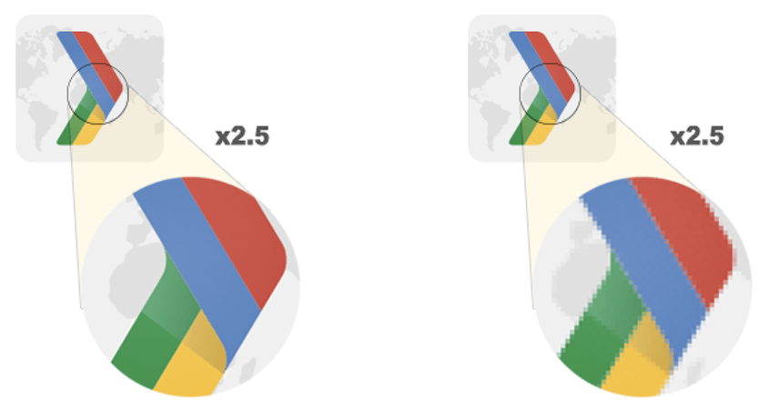
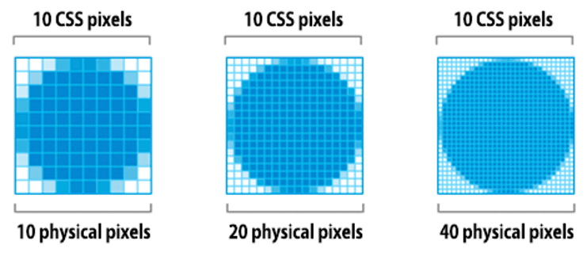

# 选择正确的图片格式

您应该问自己的第一个问题是图像是否实际上是实现您所追求的效果所必需的。好的设计很简单，而且总是会产生最好的性能。如果您可以消除一个图像资源，该资源相对于页面上的 HTML、CSS、JavaScript 和其他资产通常需要大量字节，那么这始终是最佳优化策略。也就是说，一个放置得当的图像也可以传达比一千个单词更多的信息，所以你需要找到平衡点。

接下来，您应该考虑是否有一种替代技术可以提供预期的结果，但以更有效的方式：

- **CSS 效果**（例如阴影或渐变）和 CSS 动画可用于生成与分辨率无关的资源，这些资源在每个分辨率和缩放级别上总是看起来很清晰，通常只占图像文件所需字节的一小部分。
- **Web 字体**可以使用漂亮的字体，同时保留选择、搜索和调整文本大小的能力——可用性方面的显着改进。

如果您发现自己在图片资源中编码文本，请停下来重新考虑。出色的排版对于良好的设计、品牌和可读性至关重要，但图像中的文本提供了糟糕的用户体验：文本不可选择、不可搜索、不可缩放、不可访问且对高 DPI 设备不友好。使用网络字体需要自己的一组优化，但它解决了所有这些问题，并且始终是显示文本的更好选择。

## 选择正确的图像格式

如果您确定图像是正确的选项，则应为工作仔细选择正确的图像类型。

- 矢量图使用线、点和多边形来表示图像。
- 光栅图通过对矩形网格内每个像素的单独值进行编码来表示图像。

每种格式都有自己的优缺点。矢量格式非常适合由简单几何形状（如徽标、文本或图标）组成的图像。它们在每种分辨率和缩放设置下都能提供清晰的结果，这使其成为高分辨率屏幕和需要以不同尺寸显示的理想格式。

但是，当场景复杂时（例如，照片），矢量格式就不够用了：描述所有形状的 SVG 标记量可能高得令人望而却步，而且输出看起来仍然不是“逼真的”。在这种情况下，您应该使用光栅图像格式，例如 PNG、JPEG 或 WebP。

光栅图像不具有分辨率或缩放独立的相同特性——当您放大光栅图像时，您会看到锯齿状和模糊的图形。因此，您可能需要以不同的分辨率保存多个版本的光栅图像，以便为您的用户提供最佳体验。

## 高分辨率屏幕的影响

有两种不同类型的像素：CSS 像素和设备像素。单个 CSS 像素可以直接对应于单个设备像素，也可以由多个设备像素支持。重点是什么？嗯，设备像素越多，屏幕上显示内容的细节就越精细。

高 DPI (HiDPI) 屏幕产生漂亮的效果，但有一个明显的权衡：图片资源需要更多细节才能利用更高的设备像素数。好消息是，矢量图像非常适合这项任务，因为它们可以以任何分辨率渲染并获得清晰的结果——渲染更精细的细节可能会产生更高的处理成本，但基础资产是相同的，并且与分辨率无关.

另一方面，光栅图像带来了更大的挑战，因为它们在每个像素的基础上对图像数据进行编码。因此，像素数越大，光栅图像的文件大小就越大。例如，让我们考虑以 100x100 (CSS) 像素显示的照片资源之间的差异：

| 屏幕分辨率 |  总像素 |  未压缩的文件大小（每像素 4 个字节） |
| ---        | ------  | --------------- |
| 1x |  100 x 100 = 10,000 | 40,000 字节 |
| 2x |  100 x 100 x 4 = 40,000 |  160,000 字节 |
| 3x |  100 x 100 x 9 = 90,000 |  360,000 字节 |

当我们将物理屏幕的分辨率提高一倍时，像素总数会增加四倍：水平像素数翻倍，垂直像素数翻倍。因此，“2x”屏幕不仅增加了一倍，而且增加了四倍所需的像素数量！

那么，这在实践中意味着什么？高分辨率屏幕使您能够提供精美的图像，这可能是一个很棒的产品功能。但是，高分辨率屏幕也需要高分辨率图像，因此：

- 尽可能首选矢量图像，因为它们与分辨率无关并且始终提供清晰的结果。
- 如果需要光栅图像，请提供响应式图像。

## 不同光栅图像格式的特点

除了不同的有损和无损压缩算法，不同的图像格式支持不同的特性，例如动画和透明度（alpha）通道。因此，为特定图像选择“正确格式”是所需视觉效果和功能要求的结合。

| 格式 | 透明度 | 动画 | 浏览器 |
| ---  | ---    | ---  | ---    |
| PNG  | 是的   | 不   |  全部  |
| JPEG |  不    | 不   |  全部  |
| WebP | 是的   | 是的 | 所有现代浏览器。请参阅[我可以使用吗？](https://caniuse.com/webp) |

有两种普遍支持的光栅图像格式：PNG 和 JPEG。除了这些格式之外，现代浏览器还支持更新的 WebP 格式，它提供了更好的整体压缩和更多功能。那么，您应该使用哪种格式？

WebP 格式通常比旧格式提供更好的压缩，应尽可能使用。您可以使用 WebP 和另一种图像格式作为后备。有关更多详细信息，请参阅[使用 WebP 图像](./serve-images-webp.md)。

对于较旧的图像格式，请考虑以下几点：

1. **你需要动画吗？使用 `<video>` 元素。**
  - GIF呢？GIF 将调色板限制为最多 256 种颜色，并创建比 `<video>` 元素大得多的文件大小。请参阅[用视频替换 GIF 动画以加快页面加载](./replace-gifs-with-videos.md)。
2. **您是否需要以最高分辨率保留精细细节？使用 PNG。**
  - 除了选择调色板的大小之外，PNG 不应用任何有损压缩算法。因此，它将产生最高质量的图像，但其代价是文件大小明显高于其他格式。明智地使用。
  - 如果图片资源包含由几何形状组成的图像，请考虑将其转换为矢量 (SVG) 格式！
  - 如果图片资源包含文本，请停止并重新考虑。图像中的文本不可选择、不可搜索或“可缩放”。如果您需要传达自定义外观（出于品牌或其他原因），请改用网络字体。
3. **您是否正在优化照片、屏幕截图或类似的图片资源？使用 JPEG。**
  - JPEG 使用有损和无损优化的组合来减小图像资源的文件大小。尝试几种 JPEG 质量级别，以找到资产的最佳质量与文件大小权衡。

最后，请注意，如果您使用 WebView 在特定于平台的应用程序中呈现内容，那么您可以完全控制客户端并且可以独占使用 WebP！Facebook 和许多其他公司使用 WebP 在他们的应用程序中提供他们所有的图像——节省下来的钱绝对是值得的。
