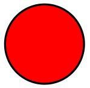
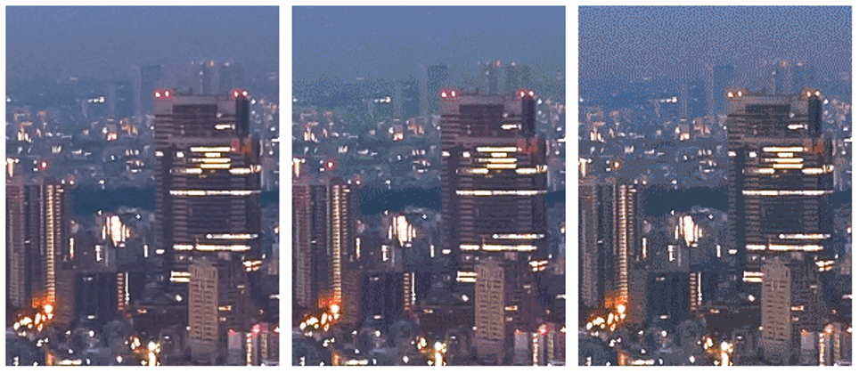

# 选择正确的压缩级别

图像通常占网页上下载的大部分字节，并且还经常占据大量视觉空间。因此，优化图像通常可以为您的网站带来最大的字节节省和性能改进：浏览器必须下载的字节越少，客户端带宽的竞争就越少，浏览器下载和呈现有用的速度就越快屏幕上的内容。

图像优化既是一门艺术也是科学：一门艺术是因为对于如何最好地压缩单个图像没有一个明确的答案，而一门科学是因为有许多成熟的技术和算法可以显着减小图像的大小。为您的图像找到最佳设置需要从多个维度进行仔细分析：格式功能、编码数据的内容、质量、像素尺寸等等。

## 优化矢量图像

所有现代浏览器都支持可缩放矢量图形 (SVG)，这是一种用于二维图形的基于 XML 的图像格式。您可以将 SVG 标记直接嵌入页面或作为外部资源。大多数基于矢量的绘图软件都可以创建 SVG 文件，或者您可以直接在您喜欢的文本编辑器中手动编写它们。

```xml
<?xml version="1.0" encoding="utf-8"?>
<!-- Generator: Adobe Illustrator 17.1.0, SVG Export Plug-In . SVG Version: 6.00 Build 0)  -->
<svg version="1.2" baseProfile="tiny" id="Layer_1" xmlns="http://www.w3.org/2000/svg" xmlns:xlink="http://www.w3.org/1999/xlink"
    x="0px" y="0px" viewBox="0 0 612 792" xml:space="preserve">
<g id="XMLID_1_">
  <g>
    <circle fill="red" stroke="black" stroke-width="2" stroke-miterlimit="10" cx="50" cy="50" r="40"/>
  </g>
</g>
</svg>
```

上面的例子渲染了下面这个简单的圆形，黑色轮廓和红色背景，是从 Adobe Illustrator 导出的。



如您所知，它包含许多元数据，例如：图层信息、注释和 XML 命名空间，这些元数据通常不需要在浏览器中呈现。因此，通过运行像 SVGO 这样的工具来缩小 SVG 文件总是一个好主意。

例如，SVGO 将 Illustrator 生成的上述 SVG 文件的大小减少了 58%，从 470 字节减少到 199 字节。

```xml
<svg version="1.2" baseProfile="tiny" xmlns="http://www.w3.org/2000/svg" viewBox="0 0 612 792"><circle fill="red" stroke="#000" stroke-width="2" stroke-miterlimit="10" cx="50" cy="50" r="40"/></svg>
```

由于 SVG 是一种基于 XML 的格式，您还可以应用 GZIP 压缩来减小其传输大小——确保您的服务器配置为压缩 SVG 资产！

光栅图像只是单个“像素”的二维网格——例如，100x100 像素的图像是 10,000 像素的序列。反过来，每个像素存储“ RGBA ”值：(R) 红色通道、(G) 绿色通道、(B) 蓝色通道和 (A) alpha（透明度）通道。

在内部，浏览器为每个通道分配 256 个值（阴影），转换为每个通道 8 位（2 ^ 8 = 256），每个像素 4 字节（4 通道 x 8 位 = 32 位 = 4 字节）。因此，如果我们知道网格的尺寸，我们可以轻松计算文件大小：

- 100x100 像素的图像由 10,000 个像素组成
- 10,000 像素 x 4 字节 = 40,000 字节
- 40,000 字节 / 1024 = 39 KB

顺便说一句，无论用于将数据从服务器传输到客户端的图像格式如何，当图像被浏览器解码时，每个像素总是占用 4 个字节的内存。对于大图像和没有大量​​可用内存的设备（例如低端移动设备）来说，这可能是一个重要的限制。

| 方面 | 像素 | 文件大小 |
| ---  | ---  | ----     |
| 100×100 | 10,000 | 39 KB |
| 200×200 | 40,000 | 156 KB |
| 300×300 | 90,000 | 351 KB |
| 500×500 | 250,000 | 977 KB |
| 800×800 | 640,000 | 2500 KB|

对于 100x100 像素的图像，39 KB 可能看起来没什么大不了的，但是对于较大的图像，文件大小会迅速爆炸，并使图像资源下载起来既慢又昂贵。到目前为止，这篇文章只关注“未压缩”的图像格式。值得庆幸的是，可以做很多事情来减小图像文件的大小。

一种简单的策略是将图像的“位深度”从每通道 8 位减少到更小的调色板：每通道 8 位为我们提供每通道 256 个值和总共 16,777,216 (256 ^ 3) 种颜色。如果将调色板减少到 256 色会怎样？然后，RGB 通道总共只需要 8 位，并立即为每个像素节省 2 个字节——与原来的每像素 4 个字节格式相比，压缩节省了 50%！



具有渐变颜色过渡（例如渐变或天空）的复杂场景需要更大的调色板以避免视觉伪影，例如 5 位资源中的像素化天空。另一方面，如果图像只使用了几种颜色，那么大调色板简直就是在浪费宝贵的比特！

接下来，一旦您优化了存储在单个像素中的数据，您就可以变得更加聪明，并且还可以查看附近的像素：结果是，许多图像，尤其是照片，有许多具有相似颜色的附近像素——例如，天空，重复纹理，等等。使用此信息对您有利，压缩器可以应用增量编码，而不是存储每个像素的单独值，您可以存储附近像素之间的差异：如果相邻像素相同，则增量为“零”，您只需需要存储一个位！但是为什么要停在那里……

人眼对不同颜色有不同程度的敏感度：您可以通过减少或增加这些颜色的调色板来优化颜色编码以解决此问题。“附近”像素形成二维网格。这意味着每个像素都有多个邻居：您可以利用这一事实进一步改进增量编码。您可以查看较大的附近像素块，并使用不同的设置对不同的块进行编码，而不是只查看每个像素的直接邻居。

如您所知，图像优化很快变得复杂（或有趣，取决于您的观点），并且是学术和商业研究的活跃领域。图像占用大量字节，开发更好的图像压缩技术具有很大的价值！如果您想了解更多信息，请访问Wikipedia 页面，或查看WebP 压缩技术白皮书以获取动手示例。

所以，再一次，这一切都很棒，但也非常学术：它如何帮助您优化网站上的图像？嗯，了解问题的形状很重要：RGBA 像素、位深度和各种优化技术。在深入讨论各种光栅图像格式之前，所有这些概念对于理解和牢记都至关重要。

## 无损与有损图像压缩

对于某些类型的数据，例如：页面的源代码或可执行文件，压缩器不会更改或丢失任何原始信息至关重要：单个丢失或错误的数据位可能会完全改变文件的内容，或者更糟的是，完全破坏它。对于某些其他类型的数据，例如图像、音频和视频，提供原始数据的“近似”表示可能是完全可以接受的。

事实上，由于眼睛的工作原理，我们通常可以通过丢弃每个像素的一些信息来减少图像的文件大小——例如，我们的眼睛对不同颜色的敏感度不同，这意味着我们可以使用更少的位来编码一些颜色。因此，典型的图像优化流程由两个高级步骤组成：

1. 图像使用有损过滤器处理，消除了一些像素数据。
2. 使用压缩像素数据的无损过滤器处理图像。

第一步是可选的，确切的算法将取决于特定的图像格式，但重要的是要了解任何图像都可以通过有损压缩步骤来减小其大小。事实上，各种图像格式（如 GIF、PNG、JPEG 等）之间的区别在于它们在应用有损和无损步骤时使用（或省略）的特定算法的组合。

那么，有损和无损优化的“最优”配置是什么？答案取决于图像内容和您自己的标准，例如文件大小和有损压缩引入的伪影之间的权衡：在某些情况下，您可能希望跳过有损优化以完全保真地传达复杂的细节。在其他情况下，您可以应用积极的有损优化来减小图像资产的文件大小。这就是你自己的判断和背景需要发挥作用的地方——没有一个通用的设置。

例如，当使用 JPEG 等有损格式时，压缩器通常会显示可自定义的“质量”设置（例如，Adobe Photoshop 中的“保存为 Web”功能提供的质量滑块），即通常是一个介于 1 到 100 之间的数字，用于控制特定有损和无损算法集合的内部工作。为获得最佳效果，请尝试为您的图像设置各种质量设置，并且不要害怕降低质量 - 视觉效果通常非常好，并且文件大小可以节省很多。

请注意，由于用于编码图像的算法不同，不同图像格式的质量级别不能直接比较：质量 90 JPEG 将产生与质量 90 WebP 截然不同的结果。事实上，即使是相同图像格式的质量级别也可能会根据压缩器的实现产生明显不同的输出！

## 图像优化清单

在优化图像时要牢记下面这些技巧：

- **首选矢量格式**：矢量图像与分辨率和比例无关，这使得它们非常适合多设备和高分辨率世界。
- **缩小和压缩 SVG 资源**：大多数绘图应用程序生成的 XML 标记通常包含可以删除的不必要的元数据；确保您的服务器配置为对 SVG 资产应用 GZIP 压缩。
- **比旧的光栅格式更倾向 WebP**：WebP 图像通常比旧图像小得多。
- **选择最佳的光栅图像格式**：确定您的功能要求并选择适合每个特定资产的格式。
- **尝试光栅格式的最佳质量设置**：不要害怕调低“质量”设置，结果通常非常好，字节节省也很重要。
- **删除不必要的图像元数据**：许多光栅图像包含有关资产的不必要的元数据：地理信息、相机信息等。使用适当的工具去除这些数据。
- **提供缩放图像**：调整图像大小并确保“显示”大小尽可能接近图像的“自然”大小。特别要密切注意大图像，因为它们在调整大小时占最大的开销！
- **自动化、自动化、自动化**：投资于自动化工具和基础设施，以确保您的所有图片资源始终得到优化。
