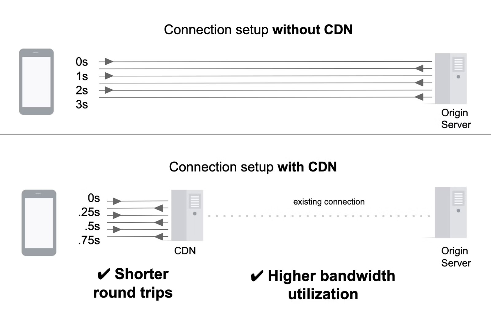
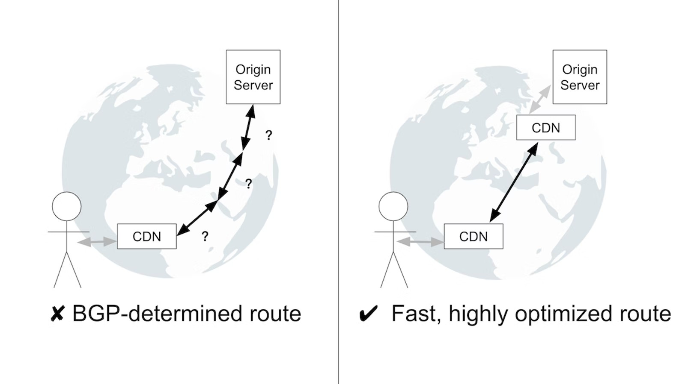
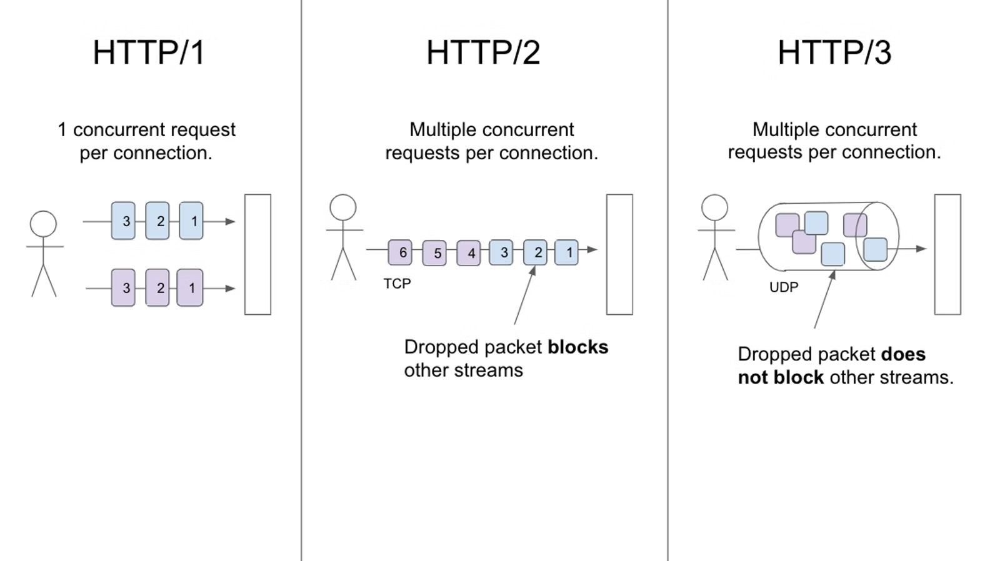
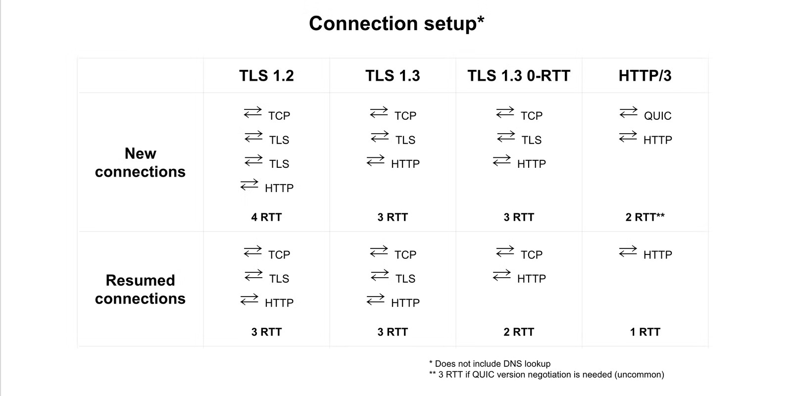

# 内容分发网络 (CDN)

内容分发网络 (CDN) 通过使用分布式服务器网络向用户交付资源来提高站点性能。由于 CDN 减少了服务器负载，因此它们降低了服务器成本，并且非常适合处理流量高峰。本文讨论了 CDN 的工作原理，并就选择、配置和优化 CDN 设置提供了与平台无关的指导。

## 概述

内容分发网络由经过优化以快速向用户交付内容的服务器网络组成。尽管 CDN 可以说以提供缓存内容而闻名，但 CDN 也可以改善不可缓存内容的交付。一般来说，CDN 提供的网站越多越好。

在高层次上，CDN 的性能优势源于以下几个原则： CDN 服务器比源服务器更靠近用户，因此具有更短的往返时间 (RTT) 延迟；与从源服务器“直接”加载内容相比，网络优化允许 CDN 更快地交付内容；最后，CDN 缓存消除了将请求传送到源服务器的需要。

**关键词**

**源服务器**是指 CDN 从中检索内容的服务器。

### 资源交付

尽管看起来不直观，但使用 CDN 来交付资源（甚至是不可缓存的资源）通常比让用户“直接”从您的服务器加载资源要快。

当 CDN 用于从源交付资源时，客户端和附近的 CDN 服务器之间会建立新的连接。旅程的其余部分（换句话说，CDN 服务器和源站之间的数据传输）发生在 CDN 的网络上 - 这通常包括与源站的现有持久连接。这样做的好处是双重的：在尽可能靠近用户的地方终止新连接消除了不必要的连接设置成本（建立新连接很昂贵并且需要多次往返）；使用预热连接允许以最大可能的吞吐量立即传输数据。

一些 CDN 通过分布在 Internet 上的多个 CDN 服务器将流量路由到源站，进一步改进了这一点。CDN 服务器之间的连接发生在可靠且高度优化的路由上，而不是由边界网关协议 (BGP) 确定的路由。尽管 BGP 是互联网事实上的路由协议，但它的路由决策并不总是以性能为导向。因此，BGP 确定的路由的性能可能不如 CDN 服务器之间的微调路由。

### 缓存

在 CDN 的服务器上缓存资源消除了请求一直传输到源以便获得服务的需要。结果，资源被更快地交付；这也减少了源服务器上的负载。

#### 向缓存中添加资源

填充 CDN 缓存的最常用方法是让 CDN 在需要时“拉”资源 - 这称为“源拉”。第一次从缓存请求特定资源时，CDN 将从源服务器请求它并缓存响应。以这种方式，随着请求额外的未缓存资源，缓存的内容随着时间的推移而建立。

#### 从缓存中删除资源

CDN 使用缓存驱逐定期从缓存中删除不那么有用的资源。此外，站点所有者可以使用清除来明确删除资源。

- **缓存驱逐**

高速缓存具有有限的存储容量。当缓存接近其容量时，它会通过删除最近未访问或占用大量空间的资源来为新资源腾出空间。此过程称为缓存逐出。从一个缓存中逐出资源并不一定意味着它已从 CDN 网络中的所有缓存中逐出。

- **吹扫**

清除（也称为“缓存失效”）是一种从 CDN 缓存中删除资源而无需等待其过期或被驱逐的机制。它通常通过 API 执行。在需要撤回内容的情况下（例如，更正拼写错误、定价错误或不正确的新闻文章），清除至关重要。最重要的是，它还可以在站点的缓存策略中发挥关键作用。

如果 CDN 支持近乎即时的清除，清除可用作管理动态内容缓存的机制：使用长 TTL 缓存动态内容，然后在资源更新时清除资源。通过这种方式，可以最大化动态资源的缓存持续时间，尽管事先不知道资源何时会发生变化。这种技术有时被称为 “hold-till-told 缓存”。

当大规模使用清除时，它通常与称为“缓存标签”或“代理缓存键”的概念结合使用。这种机制允许站点所有者将一个或多个附加标识符（有时称为“标签”）与缓存资源相关联。这些标签随后可用于执行高度精细的清除。例如，您可以将“页脚”标签添加到包含您的网站页脚的所有资源（例如,）`/about`。`/blog` 当页脚更新时，指示您的 CDN 清除与“页脚”标签关联的所有资源。

#### 可缓存资源

是否以及如何缓存资源取决于它是公共的还是私有的；静态或动态。

##### 私人和公共资源

- **私有资源**

私有资源包含针对单个用户的数据，因此不应由 CDN 缓存。私有资源由 `Cache-Control: private` 标头指示。

- **公共资源**

公共资源不包含特定于用户的信息，因此可由 CDN 缓存。如果资源没有 `Cache-Control: no-store` or `Cache-Control: private` 标头，则它可能被 CDN 视为可缓存的。公共资源可以缓存的时间长度取决于资产更改的频率。

##### 动态和静态内容

- **动态内容**

动态内容是经常变化的内容。API 响应和电商主页是这种内容类型的示例。但是，此内容经常更改的事实并不一定会阻止它被缓存。在流量大的时期，将这些响应缓存很短的时间（例如，5 秒）可以显着降低源服务器上的负载，同时对数据新鲜度的影响最小。

- **静态内容**

静态内容很少更改，如果有的话。图像、视频和版本库通常是这种内容类型的示例。因为静态内容不会改变，所以应该使用较长的生存时间 (TTL) 进行缓存——例如，6 个月或 1 年。

## 选择 CDN 

选择 CDN 时，性能通常是首要考虑因素。但是，CDN 提供的其他功能（例如，安全和分析功能）以及 CDN 的定价、支持和入职都是在选择 CDN 时需要考虑的重要因素。

### 性能

在高层次上，CDN 的性能策略可以被认为是最小化延迟和最大化缓存命中率之间的权衡。具有多个接入点 (PoP) 的 CDN 可以提供更低的延迟，但由于流量被分配到更多缓存中，因此可能会遇到更低的缓存命中率。相反，具有较少 PoP 的 CDN 可能在地理位置上距离用户较远，但可以实现更高的缓存命中率。

由于这种权衡，一些 CDN 使用分层缓存方法：靠近用户的 PoP（也称为“边缘缓存”）由具有更高缓存命中率的中央 PoP 补充。当边缘缓存找不到资源时，它将寻找资源的中央 PoP。这种方法用稍长的延迟换取了更高的可能性，即可以从 CDN 缓存提供资源 - 尽管不一定是边缘缓存。

最小化延迟和最大化缓存命中率之间的权衡是一个范围。没有一种方法是普遍更好的；但是，根据您网站的性质及其用户群，您可能会发现其中一种方法的性能明显优于另一种方法。

还值得注意的是，CDN 性能可能会因地理位置、一天中的时间甚至当前事件而有很大差异。尽管对 CDN 的性能进行自己的研究总是一个好主意，但很难预测您将从 CDN 获得的确切性能。

### 附加功能

除了核心 CDN 产品外，CDN 通常还提供多种功能。常见的功能包括：负载平衡、图像优化、视频流、边缘计算和安全产品。

## 如何设置和配置 CDN

理想情况下，您应该使用 CDN 为您的整个站点提供服务。概括地说，此设置过程包括向 CDN 提供商注册，然后更新您的 CNAME DNS 记录以指向 CDN 提供商。例如，CNAME 记录 `www.example.com` 可能指向 `example.my-cdn.com`。由于此 DNS 更改，到您网站的流量将通过 CDN 路由。

如果不能使用 CDN 提供所有资源，您可以将 CDN 配置为仅提供资源子集 - 例如，仅提供静态资源。您可以通过创建单独的 CNAME 记录来做到这一点，该记录仅用于应由 CDN 提供服务的资源。例如，您可以创建一个 `static.example.com` 指向的 CNAME 记录 `example.my-cdn.com`。您还需要重写 CDN 提供的资源的 URL，以指向 `static.example.com` 您创建的子域。

尽管此时将设置您的 CDN，但您的配置可能会效率低下。本文接下来的两部分将解释如何通过提高缓存命中率和启用性能特性来充分利用 CDN。

## 提高缓存命中率

有效的 CDN 设置将从缓存中提供尽可能多的资源。这通常通过缓存命中率 (CHR) 来衡量。缓存命中率定义为在给定时间间隔内缓存命中数除以总请求数。

新初始化的缓存的 CHR 为 0，但随着缓存填充资源而增加。对于大多数网站来说，90% 的 CHR 是一个很好的目标。您的 CDN 提供商应为您提供有关您的 CHR 的分析和报告。

在优化 CHR 时，首先要验证的是所有可缓存的资源都被缓存并缓存了正确的时间长度。这是所有站点都应进行的简单评估。

广义上讲，CHR 优化的下一个级别是微调您的 CDN 设置，以确保逻辑上等效的服务器响应不会被单独缓存。这是由于查询参数、cookie 和请求标头等因素对缓存的影响而导致的常见低效率。

### 初步审核

大多数 CDN 将提供缓存分析。此外，WebPageTest 和 Lighthouse 等工具也可用于快速验证页面的所有静态资源是否缓存了正确的时间长度。这是通过检查每个资源的 HTTP 缓存标头来完成的。使用最大适当的生存时间 (TTL) 缓存资源将避免将来不必要的原始提取，从而增加 CHR。

至少，通常需要设置这些标头之一，以便 CDN 缓存资源：

- `Cache-Control: max-age=`
- `Cache-Control: s-maxage=`
- `Expires`

此外，虽然它不会影响资源是否或如何被 CDN 缓存，但最好也设置 `Cache-Control: immutable` 指令。`Cache-Control: immutable` 表示资源“在其新鲜生命周期内不会更新”。因此，浏览器在从浏览器缓存中提供资源时不会重新验证资源，从而消除了不必要的服务器请求。不幸的是，这个指令只被 Firefox 和 Safari 支持——它不被基于 Chromium 的浏览器支持。此问题跟踪 Chromium 对 `Cache-Control: immutable`。对此问题加注星标有助于鼓励对此功能的支持。

有关 HTTP 缓存的更详细说明，请参阅使用 HTTP 缓存防止不必要的网络请求。

### 微调

CDN 缓存如何工作的一个稍微简化的解释是，资源的 URL 用作缓存和从缓存中检索资源的键。在实践中，这仍然是绝对正确的，但是由于请求标头和查询参数之类的影响而稍微复杂化了。因此，重写请求 URL 是最大化 CHR 和确保向用户提供正确内容的重要技术。正确配置的 CDN 实例在过度精细的缓存（损害 CHR）和不够精细的缓存（导致向用户提供不正确的响应）之间取得了正确的平衡。

### 查询参数

默认情况下，CDN 在缓存资源时会考虑查询参数。但是，对查询参数处理的微小调整可能会对 CHR 产生重大影响。例如：

- **不必要的查询参数**

默认情况下，即使它们可能是相同的底层资源，CDN 也会单独 `example.com/blog` 缓存。`example.com/blog?referral_id=2zjk` 这可以通过调整 CDN 的配置以忽略 `referral\_id` 查询参数来解决。

- **查询参数顺序**

CDN 将 `example.com/blog?id=123&query=dogs` 与 `example.com/blog?query=dogs&id=123`。对于大多数站点来说，查询参数顺序并不重要，因此配置 CDN 以对查询参数进行排序（从而规范化用于缓存服务器响应的 URL）将增加 CHR。

#### 变化

Vary响应标头通知缓存，对应于特定 URL的服务器响应可能会根据请求上设置的标头（例如，Accept-Language 或 Accept-Encoding 请求标头）而变化。结果，它指示 CDN 分别缓存这些响应。CDN 并未广泛支持 Vary 标头，并且可能导致无法从缓存中提供其他可缓存资源。

尽管 Vary 标头可能是一个有用的工具，但不恰当的使用会损害 CHR。此外，如果您确实使用 `Vary`，规范化请求标头将有助于改善 CHR。例如，如果不对请求标头进行规范化 `Accept-Language: en-US`，`Accept-Language: en-US,en;q=0.9` 则会导致两个单独的缓存条目，即使它们的内容可能相同。

#### Cookie

Cookie 是通过 Cookie 标头在请求上设置的；它们通过Set-Cookie标题设置在响应上。`Set-Cookie` 鉴于缓存通常不会缓存包含此标头的服务器响应，因此应避免不必要地使用标头。

## 性能特点

本节讨论 CDN 通常作为其核心产品的一部分提供的性能特性。许多网站忘记启用这些功能，从而失去了简单的性能优势。

### 压缩

所有基于文本的响应都应使用 gzip 或 Brotli 进行压缩。如果您可以选择，请选择 Brotli 而不是 gzip。Brotli 是一种较新的压缩算法，与 gzip 相比，它可以实现更高的压缩比。

Brotli 压缩有两种类型的 CDN 支持：“Brotli from origin” 和“自动 Brotli 压缩”。

#### 来自原产地的 Brotli

来自源的 Brotli 是指 CDN 提供由源进行 Brotli 压缩的资源。尽管这似乎是所有 CDN 都应该能够开箱即用地支持的功能，但它要求 CDN 能够缓存对应于资源的多个版本（换句话说，gzip 压缩和 Brotli 压缩版本）给定的 URL。

#### 自动 Brotli 压缩

自动 Brotli 压缩是指资源由 CDN 进行 Brotli 压缩。CDN 可以压缩可缓存和不可缓存的资源。

第一次请求资源时，它会使用“足够好”的压缩来提供服务 - 例如，Brotli-5。这种类型的压缩适用于可缓存和不可缓存的资源。

同时，如果资源是可缓存的，CDN 将使用离线处理以更强大但更慢的压缩级别压缩资源 - 例如 Brotli-11。一旦此压缩完成，压缩程度更高的版本将被缓存并用于后续请求。

#### 压缩最佳实践

想要最大化性能的站点应该在其原始服务器和 CDN 上应用 Brotli 压缩。源处的 Brotli 压缩最大限度地减少了无法从缓存中提供的资源的传输大小。为了防止服务请求延迟，源端应该使用相当保守的压缩级别压缩动态资源——例如，Brotli-4；静态资源可以使用 Brotli-11 进行压缩。如果一个 origin 不支持 Brotli，可以使用 gzip-6 来压缩动态资源；gzip-9 可用于压缩静态资源。

### TLS 1.3

TLS 1.3 是传输层安全 (TLS) 的最新版本，它是HTTPS使用的加密协议。与 TLS 1.2 相比，TLS 1.3 提供更好的隐私和性能。

TLS 1.3 将 TLS 握手从两次往返缩短为一次。对于使用 HTTP/1 或 HTTP/2 的连接，将 TLS 握手缩短为一次往返有效地减少了 33% 的连接建立时间。

### HTTP/2 和 HTTP/3 

HTTP/2 和 HTTP/3 都比 HTTP/1 提供了性能优势。在这两者中，HTTP/3 提供了更大的潜在性能优势。HTTP/3 尚未完全标准化，但一旦发生，它将得到广泛支持。

#### HTTP/2

如果您的 CDN 尚未默认启用 HTTP/2，则应考虑将其打开。HTTP/2 提供了优于 HTTP/1 的多项性能优势，并且受到所有主要浏览器的支持。HTTP/2 的性能特点包括：多路复用、流优先级、服务器推送和标头压缩。

- **多路复用**

多路复用可以说是 HTTP/2 最重要的特性。多路复用使单个 TCP 连接能够同时为多个请求-响应对提供服务。这消除了不必要的连接设置的开销；鉴于浏览器在给定时间可以打开的连接数是有限的，这也意味着浏览器现在能够并行请求更多页面资源。从理论上讲，多路复用消除了对连接和精灵表等 HTTP/1 优化的需求——然而，在实践中，鉴于较大的文件可以更好地压缩，这些技术将保持相关性。

- **流优先级**

多路复用启用多个并发流；流优先级提供了一个接口，用于传达每个流的相对优先级。这有助于服务器首先发送最重要的资源——即使它们没有被首先请求。

流优先级由浏览器通过依赖关系树表示，并且仅仅是偏好声明：换句话说，服务器没有义务满足（甚至考虑）浏览器提供的优先级。当通过 CDN 提供更多站点时，流优先级变得更加有效。

HTTP/2 资源优先级的 CDN 实现差异很大。要确定您的 CDN 是否完全正确地支持 HTTP/2 资源优先级，请查看HTTP/2 还快吗？.

尽管将您的 CDN 实例切换到 HTTP/2 在很大程度上是一个翻转开关的问题，但在生产中启用它之前彻底测试此更改非常重要。HTTP/1 和 HTTP/2 对请求和响应标头使用相同的约定 - 但是当不遵守这些约定时，HTTP/2 的宽容度要低得多。因此，一旦启用 HTTP/2，非规范做法（如在标头中包含非 ASCII 或大写字符）可能会开始导致错误。如果发生这种情况，浏览器下载资源的尝试将失败。失败的下载尝试将显示在 DevTools 的“网络”选项卡中。此外，控制台会显示错误消息“ERR_HTTP2_PROTOCOL_ERROR”。

#### HTTP/3

HTTP/3是HTTP/2的继承者。截至 2020 年 9 月，所有主流浏览器都对 HTTP/3 进行了实验性支持，部分 CDN 也支持它。性能是 HTTP/3 优于 HTTP/2 的主要优势。具体来说，HTTP/3 消除了连接级别的线头阻塞并减少了连接设置时间。

- **消除队首阻塞**

HTTP/2 引入了多路复用，该功能允许使用单个连接同时传输多个数据流。但是，对于 HTTP/2，一个丢弃的数据包会阻塞连接上的所有流（这种现象称为线头阻塞）。使用 HTTP/3，丢弃的数据包只会阻塞单个流。这种改进很大程度上是 HTTP/3 使用UDP（HTTP/3 通过QUIC使用 UDP ）而不是TCP的结果。这使得 HTTP/3 对于在拥塞或有损网络上传输数据特别有用。

- **减少连接设置时间**

HTTP/3 使用 TLS 1.3，因此共享其性能优势：建立新连接只需要一次往返，恢复现有连接不需要任何往返。

HTTP/3 将对网络连接不佳的用户产生最大的影响：不仅因为 HTTP/3 比其前辈更好地处理数据包丢失，而且因为 0-RTT 或 1-RTT 连接设置所带来的绝对时间节省将是在具有高延迟的网络上更大。

### 图像优化

CDN 图像优化服务通常专注于可以自动应用的图像优化，以减少图像传输大小。例如：剥离EXIF数据、应用无损压缩以及将图像转换为较新的文件格式（例如，WebP）。图像占中位数网页传输字节的约 50%，因此优化图像可以显着减小页面大小。

### 缩小

缩小从 JavaScript、CSS 和 HTML 中删除不必要的字符。最好在源服务器而不是 CDN 上进行缩小。站点所有者对要缩小的代码有更多的上下文，因此通常可以使用比 CDN 采用的更积极的缩小技术。但是，如果在源头缩小代码不是一个选项，那么通过 CDN 缩小是一个不错的选择。

## 结论

- **使用 CDN**：CDN 快速交付资源，减少源服务器上的负载，并有助于处理流量高峰。
- **尽可能积极地缓存内容**：静态和动态内容都可以而且应该被缓存——尽管持续时间不同。定期审核您的站点，以确保您以最佳方式缓存内容。
- **启用 CDN 性能功能**：Brotli、TLS 1.3、HTTP/2 和 HTTP/3 等功能进一步提高了性能
