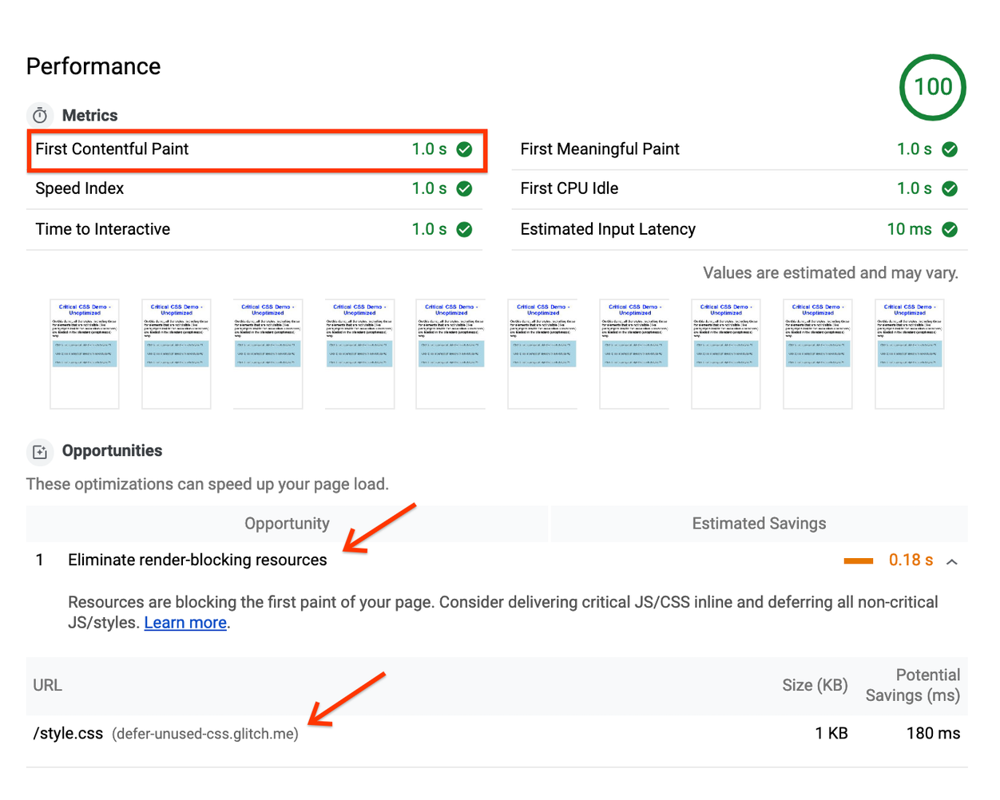
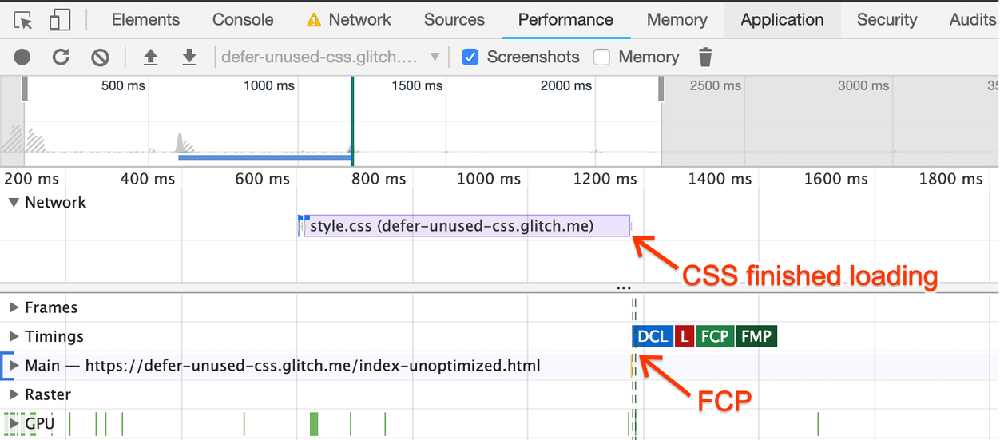
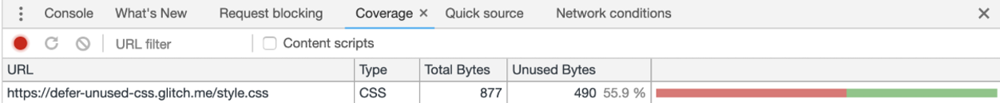
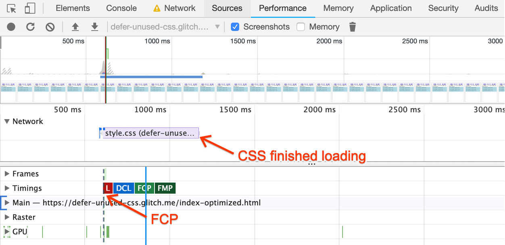
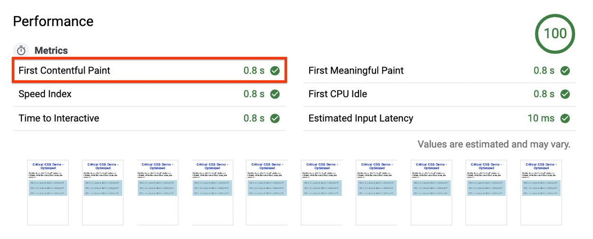
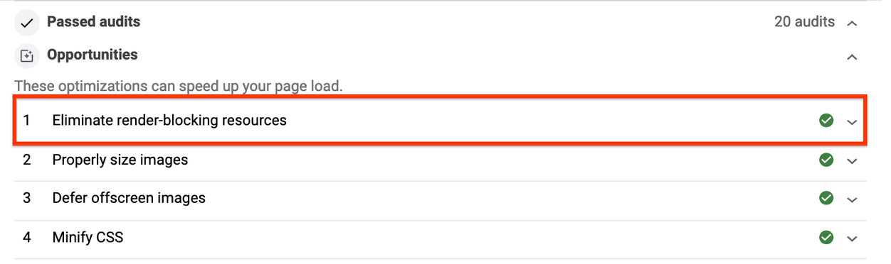

# 延迟加载非关键 CSS 

CSS 文件是[渲染阻塞资源](../lighthouse-performance/render-blocking-resources.md)：它们必须在浏览器渲染页面之前加载和处理。包含不必要的大样式的网页需要更长的渲染时间。

在本指南中，您将了解如何以优化关键渲染路径和改善 First Contentful Paint (FCP) 为目标来延迟加载非关键 CSS。

## 以次优方式加载 CSS

以下示例包含一个带有三个隐藏文本段落的可折叠项，每个文本段落都使用不同的类来设置样式：

此页面请求一个包含八个类的 CSS 文件，但并非所有类都是渲染“可见”内容所必需的。

本指南的目标是优化此页面，因此只有关键样式会同步加载，而其他样式（例如应用于段落的样式）以非阻塞方式加载。

## 测量

在页面上运行 Lighthouse 并转到 Performance 部分。

报告显示了值为“1s”的 First Contentful Paint 指标，以及消除渲染阻塞资源的机会，结果指向 style.css 文件：



用于此演示网站的 CSS 非常小。如果请求更大的 CSS 文件（这在生产场景中并不少见），并且 Lighthouse 检测到在渲染折叠项上方内容时，页面至少有 2048 字节的 CSS 规则未使用，那么您还将收到建议：删除未使用的 CSS。

要可视化此 CSS 如何阻塞渲染：

1. 在 Chrome 中打开页面。按 `Control+Shift+J` 快捷键（或者 Mac 电脑上的 `Command+Option+J` 快捷键）打开 DevTools.
2. 点击 Performance 选项卡
3. 在 Performance 面板中，单击 Reload。

在生成的跟踪中，您将看到在 CSS 完成加载后会立即放置 FCP 标记：



这意味着浏览器需要等待所有 CSS 加载完毕并得到处理，之后才能在屏幕上绘制单个像素。

## 优化

要优化此页面，您需要知道哪些类被视为“关键”类。为此，您将使用 Coverage Tool：

1. 在 DevTools 中，按下 Control+Shift+P 或 Command+Shift+P (Mac) 打开命令菜单。
2. 输入 “Coverage” 并选择 Show Coverage 。
3. 单击 Reload 按钮，重新加载页面并开始捕获覆盖范围。



双击报告，查看以两种颜色标记的类：

- 绿色（**关键**）：这些是浏览器渲染可见内容（如标题、副标题和可折叠项按钮）所需的类。
- 红色（**非关键**）：这些样式应用于非立即可见的内容（如可折叠项内的段落）。

利用此信息优化 CSS，使浏览器在页面加载后立即开始处理关键样式，同时延迟加载非关键 CSS：

- 在从覆盖工具获取的报告中提取标记了绿色的类定义，然后将这些类放在页面标题的 `<style>` 块内：

```html
<style type="text/css">
.accordion-btn {background-color: #ADD8E6;color: #444;cursor: pointer;padding: 18px;width: 100%;border: none;text-align: left;outline: none;font-size: 15px;transition: 0.4s;}.container {padding: 0 18px;display: none;background-color: white;overflow: hidden;}h1 {word-spacing: 5px;color: blue;font-weight: bold;text-align: center;}
</style>
```

- 然后，应用以下模式，异步加载其余类：

```html
<link rel="preload" href="styles.css" as="style" onload="this.onload=null;this.rel='stylesheet'">
<noscript><link rel="stylesheet" href="styles.css"></noscript>
```

这不是加载 CSS 的标准方式。以下是工作原理：

- `link rel="preload" as="style"` 异步请求样式表。您可以在预加载关键资产指南中了解有关 `preload` 的更多信息。
- `link` 的 `onload` 属性允许在加载 CSS 完成后对其进行处理。
- 在使用 `onload` 处理程序后将其“归零”有助于某些浏览器避免在切换 `rel` 属性时重新调用处理程序。
- 对 `noscript` 元素内的样式表的引用可作为不执行 JavaScript 的浏览器的后备。

在本指南中，您使用了普通代码来实现此优化。在实际的生产场景中，最好使用 loadCSS 之类的函数，它们可以封装该行为并且在不同的浏览器中都运行良好。

生成的页面看起来与以前的版本完全一样，即使大多数样式是异步加载的。以下是内联样式和对 CSS 文件的异步请求在 HTML 文件中的样子：

## 监视

使用 DevTools 在优化页面上运行另一个 Performance 跟踪。

FCP 标记出现在页面请求 CSS 之前，这意味着浏览器在渲染页面之前不需要等待 CSS 加载：



最后一步，在优化后的页面上运行 Lighthouse。

在报告中，您将看到 FCP 页面减少了 0.2s（改善了 20%！）：



消除渲染阻塞资源建议不再位于 Opportunities 下，现在属于 Passed Audits 部分：



## 后续步骤和参考

在本指南中，您了解了如何通过手动提取页面中未使用的代码来延迟加载非关键 CSS。作为补充，提取关键 CSS 指南介绍了一些最流行的关键 CSS 提取工具，并包括了一个 codelab，用于了解它们的实际工作方式。
