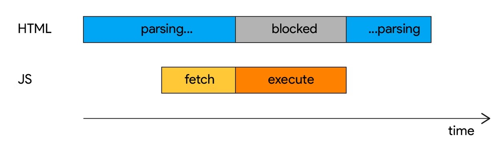
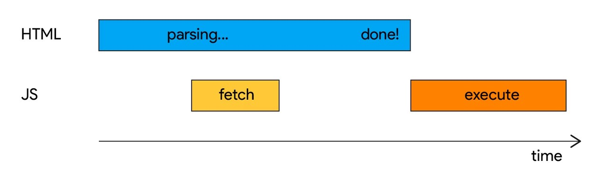
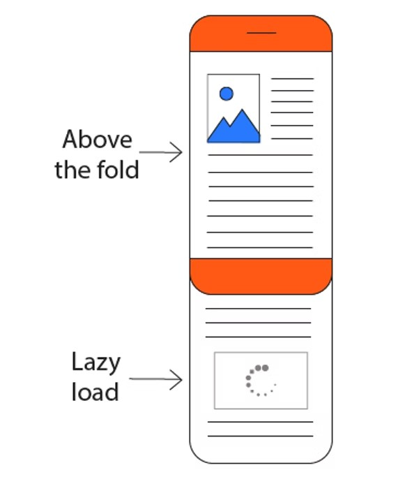

# 高效加载第三方 JavaScript

如果第三方脚本降低您的页面加载速度，您有两个选项可以提高性能：

- 如果它没有为您的网站增加明确的价值，请将其删除。
- 优化加载过程。

本文解释如何使用以下技术优化第三方脚本的加载过程：

1. 针对 `<script>` 标记使用 `async` 或 `defer` 属性
2. 建立与所需来源的早期连接
3. 延迟加载
4. 优化您使用第三方脚本的方式

## 使用 async 或 defer

由于同步脚本会延迟 DOM 构建和呈现，因此您应该始终异步加载第三方脚本，除非脚本必须在页面呈现之前运行。

`async` 和 `defer` 属性告诉浏览器其可以在后台加载脚本时继续解析 HTML，然后在加载后执行脚本。这样，脚本下载不会阻止 DOM 构建和页面呈现。这样，用户就可以在所有脚本加载完成之前看到页面。

```html
<script async src="script.js">
<script defer src="script.js">
```
`async` 和 `defer` 之间的区别在于它们何时开始执行脚本。

### async

具有 `async` 属性的脚本在完成下载后和窗口加载事件之前第一时间执行。这意味着 `async` 脚本可能（并且很可能）不会按照它们在 HTML 中出现的顺序执行。这也意味着如果它们在解析器仍在工作时完成下载，他们可以中断 DOM 构建。



### defer

具有 `defer` 属性的脚本在 HTML 解析完全完成之后执行，但在 `DOMContentLoaded` 事件之前执行。`defer` 保证脚本将按照它们在 HTML 中出现的顺序执行并且不会阻塞解析器。



- 如果在加载过程中更早地运行脚本很重要，请使用 `async`。
- 对不太重要的资源使用 `defer`。例如，低于首屏的视频播放器。

使用这些属性可以显著加快页面加载速度。例如，Telegraph 最近推迟了所有脚本，包括广告和分析，并将广告加载时间平均缩短了四秒。

分析脚本通常会提前加载，因此您不会错过任何有价值的分析数据。幸运的是，有一些模式可以在保留早期页面加载数据的同时延迟初始化分析。

## 建立与所需来源的早期联系

通过与重要的第三方来源建立早期连接，您可以节省 100–500 毫秒。

两种 `<link>` 类型可以在此方面提供帮助：

- `preconnect`
- `dns-prefetch`

### preconnect

`<link rel="preconnect">` 通知浏览器您的页面打算与另一个源建立连接，并且您希望该过程尽快开始。当从预先连接的源请求资源时，下载立即开始。

```html
<link rel="preconnect" href="https://cdn.example.com">
```

**小心**

仅预连接到您即将使用的关键域，因为浏览器会关闭所有不会在 10 秒内使用的连接。不必要的预连接会延迟其他重要资源，因此请限制预连接域的数量并测试预连接的影响。

### dns-prefetch

`<link rel="dns-prefetch>` 处理由 `<link rel="preconnect">` 处理的一小部分内容。建立连接涉及 DNS 查找和 TCP 握手，以及为了安全来源，TLS 协商。dns-prefetch 指示浏览器仅在明确调用之前解析特定域的 DNS。

`preconnect` 提示最好仅用于最关键的连接；对于不太重要的第三方域，请使用 `<link rel=dns-prefetch>`。

```html
<link rel="dns-prefetch" href="http://example.com">
```

浏览器对 `dns-prefetch` 的支持与 `preconnect` 支持略有不同，因此，`dns-prefetch` 可以作为不支持 `preconnect` 的浏览器的后备。使用单独的链接标签来安全地实现这一点：

```html
<link rel="preconnect" href="http://example.com">
<link rel="dns-prefetch" href="http://example.com">
```

## 延迟加载第三方资源

如果构建不当，嵌入的第三方资源可能是导致页面速度变慢的一个重要因素。如果它们不重要或低于首屏（即，如果用户必须滚动才能查看它们），则延迟加载是提高页面速度和绘制指标的好方法。这样，用户将更快地获得主页内容并拥有更好的体验。



一种有效的方法是在主页内容加载后延迟加载第三方内容。广告是这种方法的一个很好的候选者。

广告是许多网站的重要收入来源，但用户是为了内容而来。通过延迟加载广告并更快地提供主要内容，您可以提高广告的整体可见度百分比。例如，MediaVine 改用延迟加载广告，页面加载速度提高了 200%。DoubleClick 在其官方文档中提供了有关如何延迟加载广告的指南。

另一种方法是仅当用户向下滚动到页面的相应部分时才加载第三方内容。

Intersection Observer 是一种浏览器 API，可高效检测元素何时进入或退出浏览器视口，并可用于实现此技术。lazysizes 是一个流行的 JavaScript 库，用于延迟加载图像和 `iframes`。它支持 YouTube 嵌入和小部件。它还具有针对 IntersectionObserver 的可选支持。

**小心**

使用 JavaScript 延迟加载资源时要小心。如果 JavaScript 无法加载，可能是由于不稳定的网络条件，您的资源将根本无法加载。

将 `loading` 属性用于延迟加载图像和 iframe 是 JavaScript 技术的绝佳替代方案，并且最近 Chrome 76 中开始可用！

## 优化您服务第三方脚本的方式

### 第三方 CDN 托管

第三方供应商通常会提供他们托管的 JavaScript 文件的 URL，通常位于内容交付网络 (CDN) 上。这种方法的好处是您可以快速开始——只需复制和粘贴 URL——并且没有维护开销。第三方供应商处理服务器配置和脚本更新。

但是因为它们与您的其他资源不在同一来源，所以从公共 CDN 加载文件会产生网络成本。浏览器需要执行 DNS 查找，建立新的 HTTP 连接，并在安全来源上与供应商的服务器执行 SSL 握手。

当您使用来自第三方服务器的文件时，您几乎无法控制缓存。依赖其他人的缓存策略可能会导致不必要地频繁从网络重新获取脚本。

### 自托管第三方脚本

自托管第三方脚本是一个选项，可让您更好地控制脚本的加载过程。通过自托管，您可以：

- 减少 DNS 查找和往返时间。
- 改进 HTTP 缓存头。
- 利用 HTTP/2 服务器推送。

例如，Casper 通过自托管 A/B 测试脚本设法将负载时间缩短了 1.7 秒。

但是，自托管有一个很大的缺点：脚本可能会过时，并且在 API 更改或安全修复时不会自动更新。

**小心**

手动更新脚本会给您的开发过程增加大量开销，您可能会错过重要的更新。如果您没有使用 CDN 托管来提供所有资源，那么您也会错过边缘缓存，并且必须优化服务器的压缩。

### 使用服务工作程序缓存来自第三方服务器的脚本

自托管的另一种替代方案是使用服务工作程序缓存来自第三方服务器的脚本，这可以让您更好地控制缓存，同时仍能获得第三方 CDN 的好处。这使您可以控制从网络重新获取脚本的频率，并可以创建一种加载策略，以限制对非必要第三方资源的请求，直到页面到达关键用户时刻。在这种情况下使用 preconnect 建立早期连接也可以在一定程度上降低网络成本。
