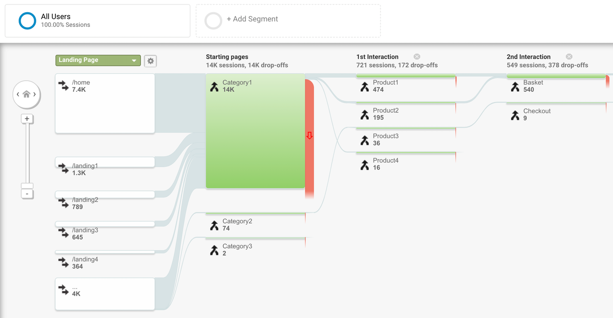

# 性能如何提高转化率？

优化您网站的性能并提高转化率。

在我们的其他电子商务指南中，您了解了应该衡量哪些指标以提高绩效，以及如何衡量和报告指标以建立绩效文化。

在本指南中，我们将介绍优化网站以提高性能以在渠道末端产生最大转化的不同方法。

## 发现

大多数情况下，新用户通过自然搜索、社交分享、网站链接或付费活动发现网站。一些重要的发现机制直接受到网站性能的影响。网站爬虫可能难以索引加载缓慢或具有大量客户端呈现和 JavaScript的网站。

速度也可以是直接的排名因素，例如在网络搜索、广告活动或社交网络上。请记住，发现您网站的新用户将获得未缓存的首次加载，因此基本上是最糟糕的体验。如果花了很多钱让用户访问网站，这可能会特别令人沮丧，只是为了看到他们由于长时间的首次加载而下降。

确保使用快速加载时间中描述的适当工具来优化第一次加载，因为第一印象很重要——如果第一次加载太慢，用户可能永远看不到优化后的第二次加载或留下来查看您的产品。一般来说，网站的加载时间与跳出率非常吻合，而跳出率通常与转化率密切相关。

## 参与度

在让用户访问您的网站后，您需要让他们与您的内容保持互动，您可以通过查看会话长度、页面停留时间、每会话页面数和一般用户流来验证您选择的分析。

除了各种 UX 最佳实践之外，流畅、快速且响应迅速的体验也是这里的关键。虽然优化网站以进行发现意味着优化首次加载，但优化参与度意味着快速导航和快速重复加载。分析用户退出流程的哪些步骤，然后与这些导航的速度指标相关联。这可以通过例如WebPageTest、Puppeteer或通过 Chrome DevTools记录功能进行分析。我们将在以下指南中向您展示更多示例。

## 转换

虽然网站转换通常与良好的发现和良好的参与度相结合，但还有几点需要记住。用户期望英雄图像加载速度快，号召性用语按钮应该快速渲染和标记，页面应该是响应式的，并且应该避免布局跳转。如果由于 CPU 繁忙或跳跃或未标记按钮而无法单击“立即购买”按钮，用户将不会购买任何东西。一般来说，最好衡量和跟踪转化或子目标的行动时间，例如购物者从登陆您的网站到查看产品到完成付款所需的中位时间。

## 重新参与

事实证明，只有 2% 的用户在首次访问时进行了转化，因此让另外 98% 的用户再次访问并重新与您的内容互动非常重要。现代网站有不同的方法来做到这一点，例如通过邮件、再营销中的定制展示广告或通知。如果从重新参与到网站的流程尽可能顺畅，则此方法效果最佳。不幸的是，情况并非总是如此，例如邮件应用程序经常在其应用程序内 web 视图中打开链接，从而减慢页面加载速度并通过不同的缓存和 cookie 存储使登录变得复杂。确保针对快速重复加载和流畅的 UX 流程进行优化，以增加重新参与的机会。

## 回顾

电子商务网站总是力求转化，这是购买漏斗的末端。漏斗中的每一步都需要针对网站速度进行优化，以最大限度地减少跳出率和流失率，并且对于每一步，都有不同的事情需要优化，不同的陷阱和罪魁祸首：

要了解更多信息，请务必查看本系列中有关衡量以提高绩效以及如何报告指标以建立绩效文化的其他帖子。
