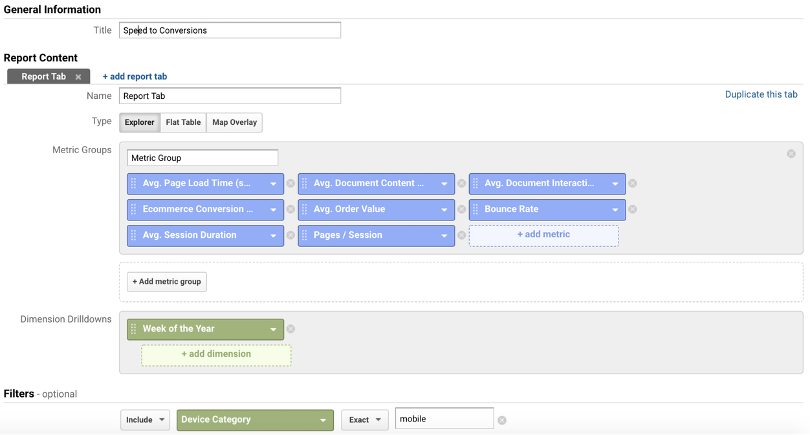
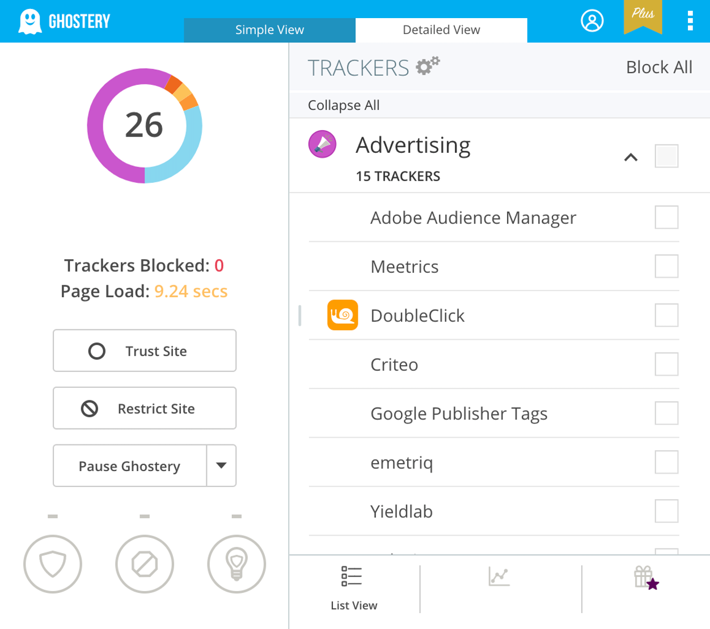

# 如何报告指标和建立绩效文化

了解为什么在转换方面性能很重要。

## 简介

网站性能是电子商务转换的关键目标，因此它必须是业务利益相关者和领导层的核心优先事项，而不仅仅是开发团队。

出于这个原因，让所有利益相关者都能看到和有形的绩效指标，并将报告和监控构建到您的工作流程中，这一点至关重要。

本指南描述了成功实现这一目标的注意事项和避免事项。

## 关于指标的一句话

评估网站性能的指标数不胜数，虽然收集所有指标似乎很有用，但过多的指标可能会造成混淆和误导。有几种方法可以解决这个问题：

- 收集多个指标，然后尝试缩小和过滤可能与手头任务相关的内容。
- 将指标抽象为总分，例如Lighthouse 所做的。这对非技术人员和其他利益相关者特别有用，但可能不足以进行更深入的技术分析。
- 尝试找到与您的转化最相关的一个指标，然后针对此进行优化。

实际上，务实的组合在这里最有意义。一开始就收集更多而不是更少，向管理层报告一个抽象分数，并针对最能预测您的转化的一个指标进行优化。

可以通过使用您选择的分析工具将性能指标映射到用户参与度、转化率和交易价值来查找此指标。例如，执行此操作的自定义报告在 Google Analytics（分析）中如下所示：

**警告**

**指标可能具有欺骗性**。不幸的是，指标有时会在性能方面产生误导。继续阅读以了解具体情况。

## 提高跳出率

### 问题

通常假设当页面加载速度增加时跳出率会下降。虽然这通常是正确的，但测量有时会显示相反的结果。这是因为分析只能在加载分析库后测量反弹。更快的页面加载意味着分析代码的加载速度也更快，因此即使没有更多的发生，分析也可能会看到更多的反弹。

### 解决方案

这可以通过测量实际页面放弃来缓解。

## 减少相对转化

### 问题

对于速度更快的网站，相对转化率有时似乎会下降。这是因为更快的页面可以覆盖更多可能参与度或投入度较低的受众。虽然增加的流量和转换随着页面速度的增加而增加，但相对转换（转换与页面浏览量或访问者的比率）可能仍会下降。

### 解决方案

这种影响可以通过寻找绝对转化来缓解，甚至可以计算每次销售成本（转化除以投资水平）或投资回报率。

## 放弃订婚

### 问题

页面参与度似乎会下降，以获得更快的页面。

### 解决方案

这实际上可能是一个积极的信号！如果页面速度更快，用户可以更快地达到他们的目标，并且可能只有更短的会话和更少的页面时间。

## 使用平均值或中位数

### 问题

通常，查看性能指标的平均值和中位数可能具有欺骗性（请参阅关于延迟的所有知识都是错误的详细描述）。类似于链条与最薄弱的环节一样坚固，漏斗的性能仅与其最慢的负载一样好。一个缓慢的加载可能足以失去用户。因此，平均值和中位数更有可能隐藏真正的绩效问题，而不是揭示它们。

### 解决方案

最好分析完整的分布，但由于这并不总是很容易实现，我们建议使用第 90 个百分位 - 这是 90% 的负载更快的值。即使这样，用户点击十页仍然会比这慢一个加载，并且可能会退出。

虽然绩效衡量非常重要，但请务必保持开放的心态并质疑意外的结果，并确保不会向利益相关者和管理层报告误导性数字。如果不确定要选择和报告什么，我们建议至少 90% 的First Contentful Paint，这也是我们在公共工具中使用的。

## 第三方内容

网站性能特别容易受到第三方内容的拖累（请参阅消除渲染阻塞资源）。这是电子商务的一个特殊问题，通常是由于跟踪器和小部件。

在性能方面处理第三方内容的一些方法：

- 始终将第三方内容置于关键渲染路径之外。如果第三方出现服务器问题并超时，将会严重影响您的网站。您可以通过 WebPageTest Single-Point-of-Failure 测试对其进行测试和模拟。
- 持续测量和报告第三方内容的比例，例如通过 WebPageTest 域细分。确保将性能预算用于第三方内容。
- 如果您怀疑某个特定的第三方组件对性能有不利影响，请对包含和排除的组件进行性能比较。了解如何。
- 如果可能的话，尽量与一个供应商保持一致。例如，如果您在一个堆栈上有标签管理器和分析，您可能只需要一个脚本，并且可能能够利用 HTTP2 协同作用，因为只涉及一个主机。
- 确保不要使用来自两个不同供应商的相同功能。您不需要两个标签管理器或两个分析平台。
- 定期审核并清除多余的第三方脚本、跟踪器和小部件。这可以通过Ghostery Extension或WhatRuns等工具轻松完成：

在加载第三方 JavaScript中了解更多信息。

## 表演文化

不幸的是，性能通常被视为一次性的优化任务，然后随着利益相关者提出新的功能请求或坚持添加新的跟踪器和小部件而随着时间的推移而倒退。

绩效必须是提高获取率、发现率和转化率以及维护品牌声誉的持续目标。这可以通过像Tinder 那样的绩效预算来实现，并通过建立和培养一种绩效文化来实现，在这种文化中，所有员工，尤其是决策者都将速度视为网站的核心特征。

## 使指标有形

关于指标的报告通常很抽象，很容易被质疑或驳回。最好让你的表现有形和可见。有几种好方法可以做到这一点：

- Facebook和谷歌通过在整个公司提供慢速网络进行测试来做到这一点。
- 向管理层和其他利益相关者提供具有低带宽或高延迟的普通、低规格设备。
- 考虑在您的开发或登台服务器上添加显示性能指标的叠加层。默认情况下，从移动设备到这些服务器的连接在公司网络上可能会受到限制。
- 显示器可以战略性地放置在整个公司中，显示您网站加载行为的视频或时间段，最好与竞争对手进行比较。WebPageTest可以很容易地自动创建这些。
- 性能也可以很有趣——也许基于单个 Lighthouse 报告的游戏可以接触到纯粹的报告和指标无法接触到的受众？

## 回顾

本指南解释了为什么指标的选择以及如何报告和处理它们与测量和优化本身一样重要，甚至更多。确保比平均值更喜欢百分位数或分布，谨慎使用跳出率或相对转化率作为影响衡量标准，并确保指标易于理解和对整个公司的利益相关者有形。建立绩效文化也是迈向良好绩效电子商务网站的重要一步。
