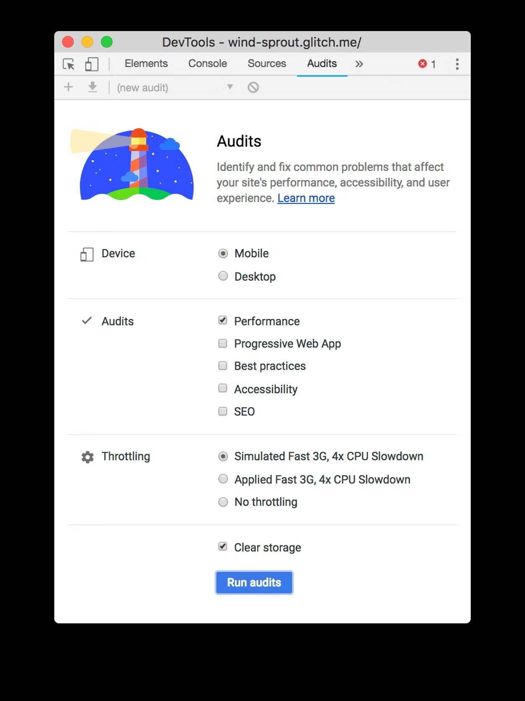
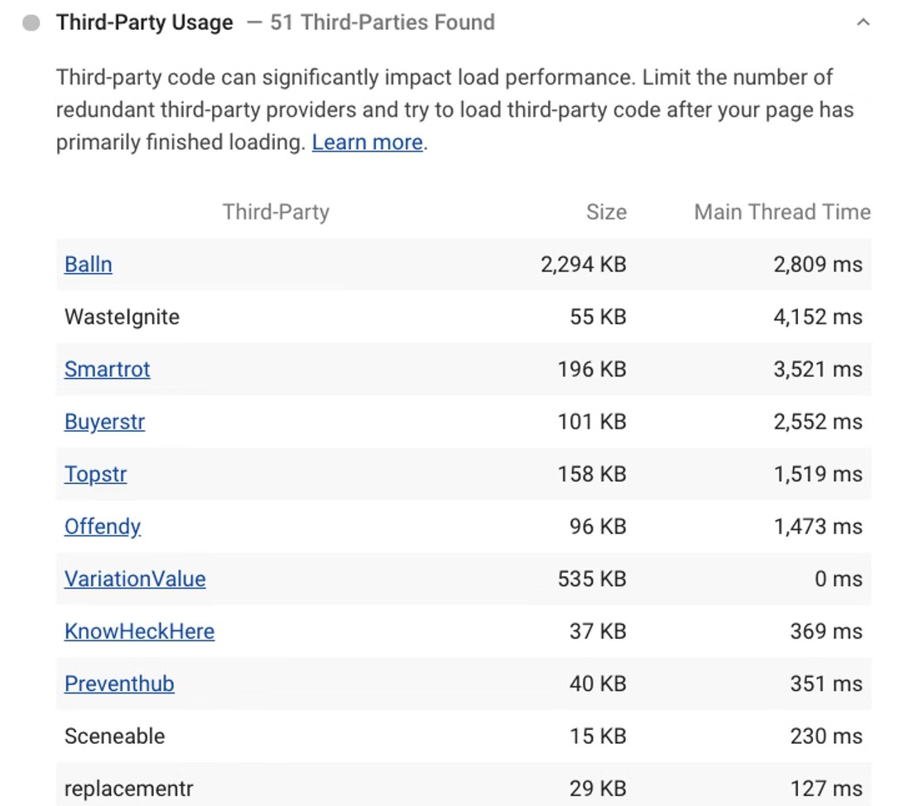
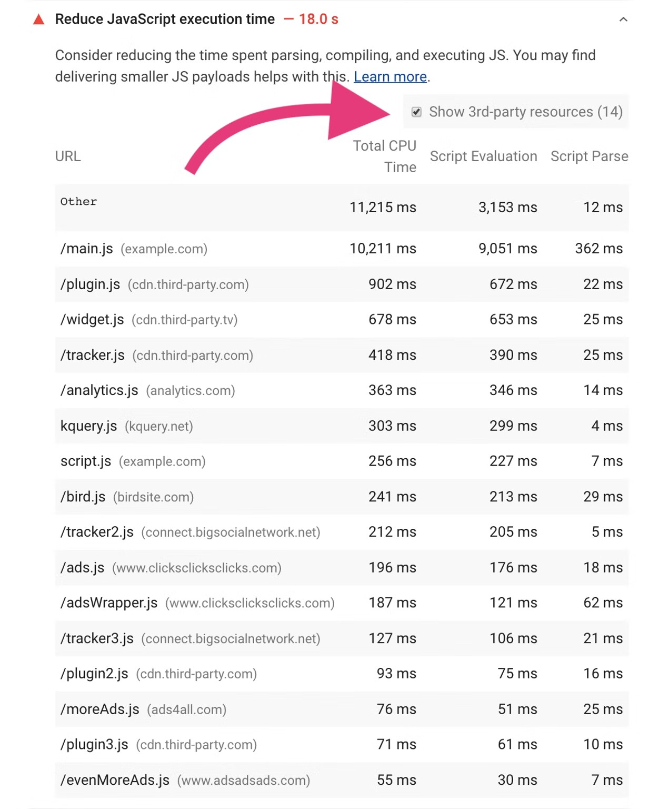
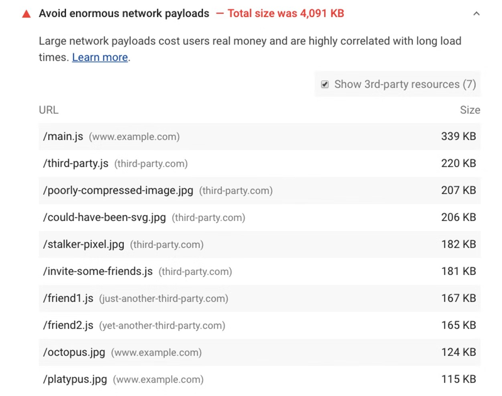
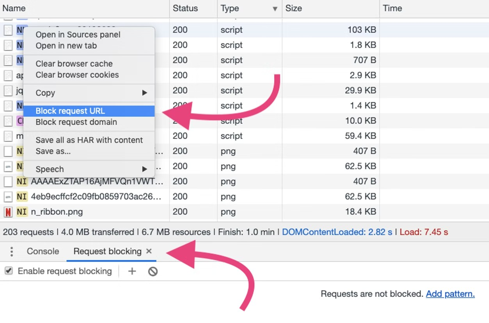

# 识别慢速第三方 JavaScript

作为开发人员，您通常无法控制站点加载哪些第三方脚本。在您可以优化第三方内容之前，您必须做一些侦探工作来找出是什么让您的网站变慢。

在这篇文章中，您将学习如何使用 Lighthouse 和 Chrome DevTools 来识别缓慢的第三方资源。这篇文章介绍了最好结合使用的越来越强大的技术。

## 如果你只有5分钟

Lighthouse 性能审计可帮助您发现加快页面加载速度的机会。缓慢的第三方脚本可能会出现在“减少 JavaScript 执行时间”和“避免大量网络负载审计”下的“诊断”部分中。

要运行审计：

- 按 `Control+Shift+J`（或 Mac 上的 `Command+Option+J`）打开 DevTools。
- 单击灯塔选项卡。
- 单击移动。
- 选择性能复选框。（您可以清除“审核”部分中的其余复选框。）
- 单击Simulated Fast 3G, 4x CPU Slowdown。
- 选择清除存储复选框。
- 单击运行审核。

### 第三方使用

Lighthouse第三方使用审计显示页面使用的第三方提供商列表。此概述可以帮助您更好地了解全局并识别冗余的第三方代码。该审计可在Lighthouse 扩展中使用，并将很快添加到 Chrome 77 中的 DevTools。

使用Startup generator生成的第三方提供商名称。与实际创业公司的任何相似之处，无论是生是死，纯属巧合。

### 减少 JavaScript 执行时间

Lighthouse减少 JavaScript 执行时间审计突出显示需要很长时间来解析、编译或评估的脚本。选中Show 3rd-party resources复选框以发现 CPU 密集型第三方脚本。

### 避免巨大的网络负载

Lighthouse Avoid huge network payloads审计可识别可能会减慢页面加载时间的网络请求（包括来自第三方的请求）。当您的网络负载超过 4,000 KB 时，审核将失败。

## 在 Chrome DevTools 中阻止网络请求

Chrome DevTools网络请求阻止功能可让您查看在特定脚本、样式表或其他资源不可用时页面的行为。在您确定您怀疑影响性能的第三方脚本后，通过阻止对这些脚本的请求来衡量您的加载时间如何变化。

要启用请求阻止：

1. 按 `Control+Shift+J`（或 Mac 上的 `Command+Option+J`）打开 DevTools。
2. 单击网络选项卡。
3. 右键单击“网络”面板中的任何请求。
4. 选择阻止请求 URL。

一个请求阻止选项卡将出现在 DevTools 抽屉中。您可以管理在那里阻止了哪些请求。

要衡量第三方脚本的影响：

1. 使用“网络”面板测量页面加载所需的时间。要模拟真实情况，请打开网络限制和 CPU 限制。（在更快的连接和桌面硬件上，昂贵脚本的影响可能不像在手机上那样具有代表性。）
2. 阻止您认为存在问题的第三方脚本的 URL 或域。
3. 重新加载页面并重新测量在没有被阻止的第三方脚本的情况下加载需要多长时间。

您应该希望看到速度有所提高，但偶尔阻止第三方脚本可能不会产生您期望的效果。如果是这种情况，请减少被阻止的 URL 列表，直到隔离导致速度缓慢的 URL。

请注意，进行三次或更多次测量并查看中值可能会产生更稳定的结果。由于第三方内容偶尔会在每次页面加载时引入不同的资源，因此这种方法可以为您提供更现实的估计。DevTools 现在支持Performance面板中的多个记录，这让这变得更容易了。
