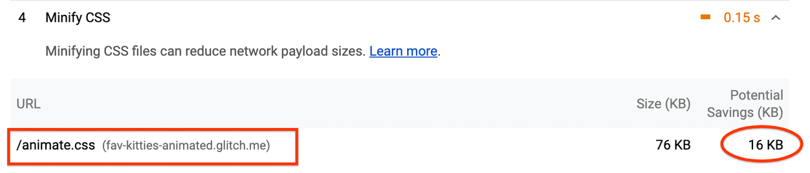
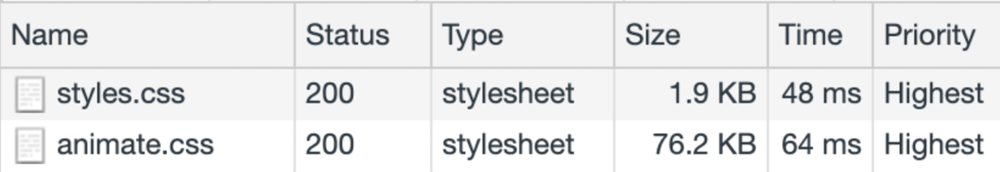
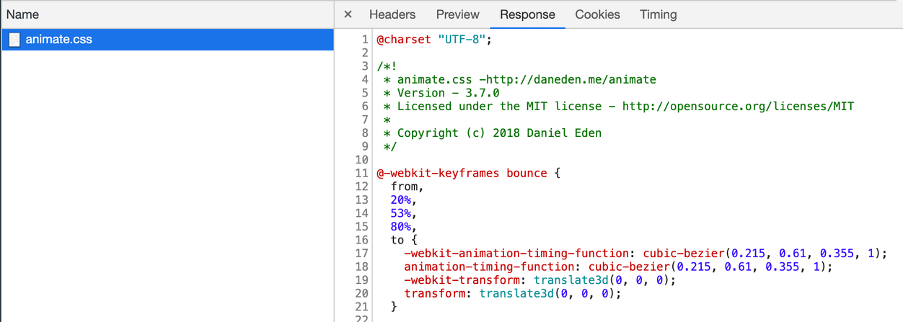
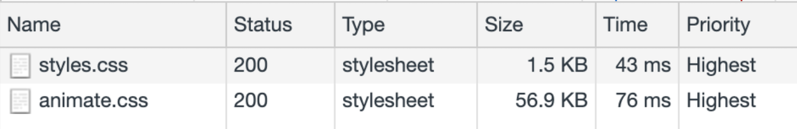
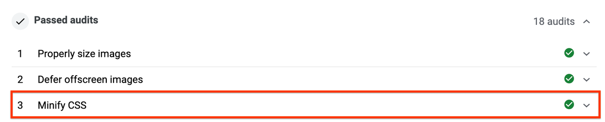

# 缩小 CSS

CSS 文件可以包含不必要的字符，例如：注释、空格和缩进。在生产中，可以安全地删除这些字符，以减小文件大小而不影响浏览器处理样式的方式。这种技术称为缩小。

## 加载未缩小的 CSS

看看下面的 CSS 块：

```css
body {
  font-family: "Benton Sans", "Helvetica Neue", helvetica, arial, sans-serif;
  margin: 2em;
}

/* all titles need to have the same font, color and background */
h1 {
  font-style: italic;
  color: #373fff;
  background-color: #000000;
}

h2 {
  font-style: italic;
  color: #373fff;
  background-color: #000000;
}
```

此内容易于阅读，但代价是生成了一个比必要文件更大的文件：

- 它使用空格进行缩进，并包含被浏览器忽略的注释，因此它们可以被删除。
- `<h1>` 和元素具有相同的 `<h2>` 样式：而不是单独声明它们：`h1 {...} h2 {...}` 它们可以表示为 `h1, h2{...}`。
- `background-color`，`#000000` 可以表示为 `#000`。

进行这些更改后，您将获得相同样式的更紧凑版本：

```css
body{font-family:"Benton Sans","Helvetica Neue",helvetica,arial,sans-serif;margin:2em}h1,h2{font-style:italic;color:#373fff;background-color:#000}
```

你可能不想那样写 CSS。相反，您可以像往常一样编写 CSS，并在构建过程中添加一个压缩步骤。在本指南中，您将学习如何使用流行的构建工具：webpack。

## 测量

您将 CSS 压缩应用到已在其他指南中使用过的网站：Fav Kitties。这个版本的网站使用了一个很酷的 CSS 库：animate.css，当用户投票给猫时，可以为不同的页面元素制作动画。

作为第一步，您需要了解压缩此文件后的机会：

1. 打开测量页面。
2. 输入 URL: `https://fav-kitties-animated.glitch.me` 并单击 Run Audit。
3. 单击查看报告。
4. 单击性能并转到机会部分。

生成的报告显示最多可以从 `animate.css` 文件中保存 16 KB：



现在检查 CSS 的内容：

1. 在 Chrome 中打开 Fav Kitties 网站。（Glitch 服务器第一次响应可能需要一段时间。）
2. 按 `Control+Shift+J`（或 Mac 上的 `Command+Option+J`）打开 DevTools。
3. 单击网络选项卡。
4. 单击 CSS 过滤器。
5. 选中禁用缓存复选框。
6. 重新加载应用程序。



该页面请求两个 CSS 文件，分别为 1.9KB 和 76.2KB。

1. 单击 animate.css。
2. 单击响应选项卡以查看文件内容。

请注意，样式表包含用于空格和缩进的字符：



接下来，您将在构建过程中添加一些 webpack 插件来缩小这些文件。

**注意**：之前的 Lighthouse 报告仅列出 animate.css 了缩小的机会。缩小 style.css 也会节省一些字节，但不足以让 Lighthouse 认为它是一个显着的节省。然而，缩小 CSS 是一种普遍的最佳实践。所以压缩所有的 CSS 文件是有意义的。

## 使用 webpack 缩小 CSS

在开始优化之前，花点时间了解 Fav Kitties 网站的构建过程是如何工作的：

默认情况下，webpack 生成的 JS 包将包含内联的 CSS 文件的内容。由于我们想维护单独的 CSS 文件，我们使用了两个互补的插件：

- mini-css-extract-plugin 会将每个样式表提取到自己的文件中，作为构建过程的步骤之一。
- webpack-fix-style-only-entries 用于纠正 wepback 4 中的问题，以避免为webpack-config.js中列出的每个 CSS 文件生成额外的 JS 文件。

您现在将对项目进行一些更改：

- 在 Glitch 中打开 Fav Kitties 项目。
- 要查看源，请按查看源。
- 单击Remix to Edit以使项目可编辑。
- 单击工具。
- 单击日志。
- 单击控制台。

要缩小生成的 CSS，您将使用 optimize-css-assets-webpack-plugin：

- 在 Glitch 控制台中，运行 npm install --save-dev optimize-css-assets-webpack-plugin.
- Run refresh，因此更改与 Glitch 编辑器同步。

接下来，回到 Glitch 编辑器，打开 webpack.config.js 文件，进行如下修改：

在文件开头加载模块：

```javascript
const OptimizeCSSAssetsPlugin = require("optimize-css-assets-webpack-plugin");
```

然后，将插件的一个实例传递给 plugins 数组：

```javascript
plugins: [
    new HtmlWebpackPlugin({template: "./src/index.html"}),
    new MiniCssExtractPlugin({filename: "[name].css"}),
    new FixStyleOnlyEntriesPlugin(),
    new OptimizeCSSAssetsPlugin({})
]
```

进行更改后，将触发项目的重建。这就是生成的 webpack.config.js 的样子：

接下来，您将使用性能工具检查此优化的结果。

## 验证

- 要预览站点，请按View App。然后按全屏。

如果您在之前的任何步骤中迷失了方向，可以单击此处打开优化版网站。

要检查文件的大小和内容：

1. 按 `Control+Shift+J`（或 Mac 上的 `Command+Option+J`）打开 DevTools。
2. 单击网络选项卡。
3. 单击CSS过滤器。
4. 如果尚未选中禁用缓存复选框。
5. 重新加载应用程序。



您可以检查这些文件，并查看新版本不包含任何空格。两个文件都小得多，特别是animate.css减少了~26%，节省了~20KB！

作为最后一步：

1. 打开测量页面。
2. 输入优化站点的 URL。
3. 单击查看报告。
4. 单击性能并找到机会部分。

该报告不再将 “Minify CSS” 显示为 “Opportunity”，现在已移至 “Passed Audits” 部分：



由于 CSS 文件是阻止渲染的资源，如果您在使用大型 CSS 文件的网站上应用缩小，您可以看到诸如 First Contentful Paint 等指标的改进。

## 后续步骤和资源

在本指南中，我们介绍了使用 webpack 进行 CSS 缩小，但其他构建工具也可以遵循相同的方法，例如：Gulp 的 gulp-clean-css 或 Grunt 的 grunt-contrib-cssmin。

缩小也可以应用于其他类型的文件。查看 Minify and compress network payloads 指南，了解更多关于压缩 JS 的工具，以及一些补充技术，如压缩。
