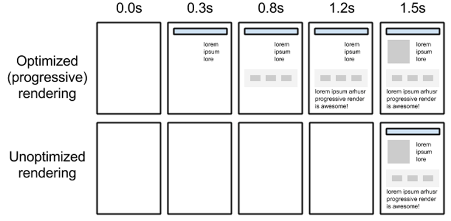

# 性能预算基础

性能是用户体验的��组�部分，它会影�业务绩效。人们很容易认为，如�你是一个优秀的开�人员，你最终会得到一个高性能的网站，但事�是，良好的性能很少是开�的副产�。�大多数其他事情一样，�达到目标，你必须清楚地定义它，并且�通过制定预算开始�手。

## 定义

性能预算是对网站性能指标产生影�的一组�制�件。这�能是页�的总大��在移动网络上加载所需的时间，甚至是��的 HTTP 请求数。定义预算有助��动 Web 性能测试和调优。它�以为网站设计�技术选�以�功能特性的添加，等�供决策�考。

有了预算，设计师就�以考虑高分辨�图�以�他们选择的网页字体数�对性能的影�。它还�以帮助开�人员比较解决问题的��方法，并且根�框�和库的大�以�解��本对其进行评估。

## 选择指标

### 基�数�的指标

这些指标在开�的早期�常有用，因为它们�显了包��大图片和脚本对性能的影�。它们也很容易�设计人员和开�人员进行沟通。

我们已��到了一些�以在性能预算中包�的内容，例如：页�体积以� HTTP 请求数，但您�以将这些拆分为更精细的�制，例如：

- 图片的最大尺寸
- 网页字体数的最大数�
- 脚本（包括框�）的最大体积
- 外部资�（如第三方脚本）的总数

但是，这些数字并�能告诉您有关用户体验的更多信�。具有相�请求数或相�大�的两个页�，�以根�请求资�的顺�，以��的方�呈�。如��个页�上的关键资�（如主图片或样�表）在�程的�期加载，则用户将等待更长的时间�能看到有用的东西，并认为页�速度较慢。而在�一个页�上，最��的部分加载得很快，他们甚至�能�会注�到页�的其余部分没有加载。

上图显示网页基�关键路径的�进渲染

这就是为什么�跟踪�一�类�的指标的���因。

### 里程碑时间

里程碑时间标记在页�加载期间�生的事件，如 DOMContentLoaded 或 load 事件。最有用的计时是以用户为中心的性能指标，这些指标�以告诉您有关加载页�的体验。这些指标�通过�览器 API �得，并作为 Lighthouse 报告的一部分�供。

FCP 测��览器何时显示 DOM 中的第一�内容，如文本或图�。

Time to Interactive (TTI) measures how long it takes for a page to become fully interactive and reliably respond to user input. It's a very important metric to track if you expect any kind of user interaction on the page like clicking links, buttons, typing or using form elements.
TTI 测�页�完全交互并��地�应用户输入所需的时间。这是一个�常��的指标，�以跟踪您是�期望在页�上进行任何类�的用户交互，例如�击链�，按钮，键入或使用表�元素。

### 基�规则的指标

Lighthouse and WebPageTest calculate performance scores based on general best practice rules, that you can use as guidelines. As a bonus, Lighthouse also offers you hints for simple optimizations.

You'll get the best results if you keep track of a combination of quantity-based and user-centric performance metrics. Focus on asset sizes in the early phases of a project and start tracking FCP and TTI as soon as possible.

Lighthouse 和 WebPageTest 根�一般最佳�践规则计算性能分数，您�以将其用作指�。作为奖励，�塔还为您�供了简�优化的�示。

如�您跟踪基�数�和以用户为中心的绩效指标的组�，您将�得最佳结�。在项目的早期阶段关注资产规模，并尽快开始跟踪FCP和TTI。

## 建立基线

The only way to really know what works best for your site is to try it—research and then test your findings. Analyze the competition to see how you stack up. 🕵�

If you don't have time for that, here are good default numbers to get you started:
真正知�什么最适�您的网站的唯一方法是�试它 - 研究然�测试您的��。分��争对手，看看你的�力如何。🕵�

如�您没有时间，这里有一些很好的默认数字�以帮助您入门：

Under 5 s Time to Interactive
Under 170 KB of critical-path resources (compressed/minified)
- 5 秒以下的互动时间
- 关键路径资��� 170 KB（�缩/缩�）

These numbers are calculated based on real-world baseline devices and 3G network speed. Over half of the internet traffic today happens on mobile networks, so you should use 3G network speed as a starting point.
这些数字是根��际基准设备和3G网络速度计算得出的。如今，超过一�的互�网���生在移动网络上，因此您应该使用3G网络速度作为起点。

## Examples of budgets预算示例

You should have a budget in place for different types of pages on your site since the content will vary. For example:
您应该为网站上��类�的网页制定预算，因为内容会有所��。例如：

Our product page must ship less than 170 KB of JavaScript on mobile
Our search page must include less than 2 MB of images on desktop
Our home page must load and get interactive in < 5 s on slow 3G on a Moto G4 phone
Our blog must score > 80 on Lighthouse performance audits
我们的产�页�必须在移动设备上�布少� 170 KB 的 JavaScript
我们的�索页�在桌�设备上包�的图片必须少� 2 MB
我们的主页必须在Moto G4手机上的慢速3G上加载并在5秒内<进行交互
我们的�客必须在�塔性能审计方��得>80分

## Add performance budgets to your build process
�生�过程添加性能预算

Webpack, bundlesize and Lighthouse logos
Choosing a tool for this will depend a lot on the scale of your project and resources that you can dedicate to the task. There are a few open-source tools that can help you add budgeting to your build process:
为此选择一个工具将在很大程度上�决�项目的规模和您�以用�任务的资�。有一些开�工具�以帮助您将预算添加到�建过程中：

- Webpack 性能特性
- bundle 大�
- Lighthouse CI

If something goes over a defined threshold, you can either:
如��些内容超过定义的阈值，您�以：

Optimize an existing feature or asset 🛠�
Remove an existing feature or asset 🗑�
Not add the new feature or asset ✋⛔
- 优化�有�素或资产
- 移除�有�素或资产
- �添加新功能或资产 ✋⛔

## 跟踪性能

Making sure your site is fast enough means you have to keep measuring after the initial launch. Monitoring these metrics over time and getting data from real users will show you how changes in performance impact key business metrics.
确�您的网站足够快�味�您必须在首次�布�继续进行测�。��时间的�移监�这些指标并�真�用户那里��数�，将�您展示性能的�化如何影�关键业务指标。

## 总结

The purpose of a performance budget is to make sure you focus on performance throughout a project and setting it early will help prevent backtracking later. It should be the point of reference for helping you figure out what to include on your website. The main idea is to set goals so that you can better balance performance without harming functionality or user experience.

The next guide will walk you through defining your first performance budget in a few simple steps.
性能预算的目的是确�您专注�整个项目的性能，尽早设置它将有助�防止以��溯。它应该是帮助您弄清楚�在网站上包�的内容的�考点。主��想是设定目标，以便您�以更好地平衡性能，而�会�害功能或用户体验。

下一个指�将通过几个简�的步骤引导您定义第一个效�预算。
