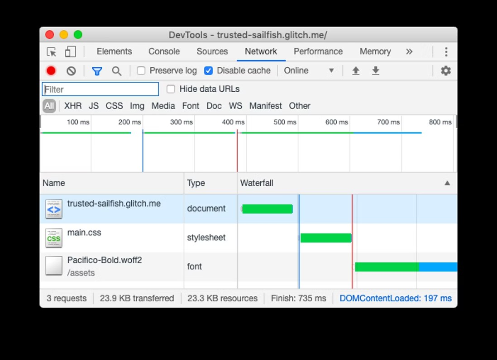
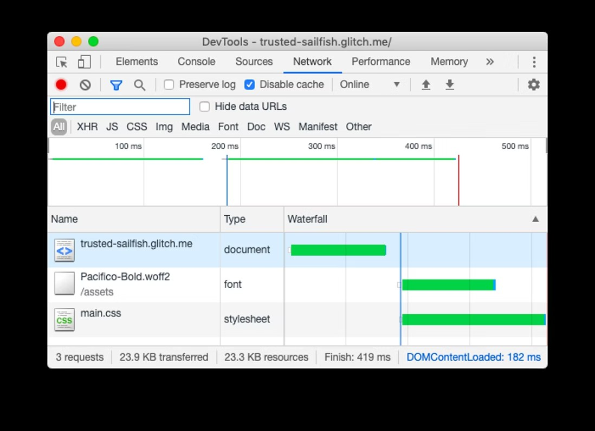
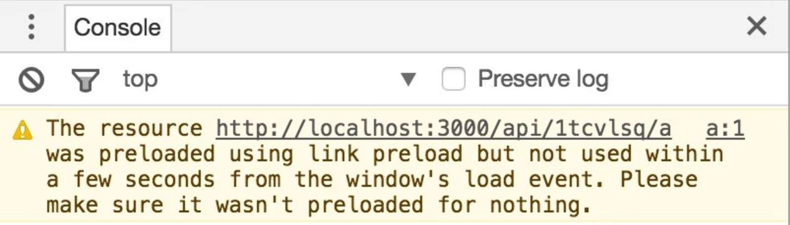

# 预加载关键资产以提高加载速度

打开网页时，浏览器会从服务器请求 HTML 文档，解析其内容，并为引用资源提交单独请求。作为开发人员，您知道页面需要的所有资源以及哪些资源最为重要。您可以使用这些知识提前请求关键资源，加快加载的过程。本文介绍了如何使用 `<link rel="preload">` 来达成此目的。

## 预加载的工作原理

预加载最适合用于浏览器通常较晚发现的资源。



在本例中，Pacifico 字体是在样式表通过 @font-face 规则定义的。浏览器只有在完成下载和解析样式表后才会加载字体文件。

通过预加载某个资源，您希望浏览器可以比正常发现它更早地获取该资源，因为您认为它对当前页面很重要。



在本例中，已预加载了 Pacifico 字体，所以下载会与样式表并行进行。

关键请求链代表着浏览器优先处理和获取的资源顺序。Lighthouse 会将位于该链第三层的资产识别为后期发现的资产。您可以使用预加载关键请求审计来确定要预加载的资源。


您可以通过在 HTML 文档的头部添加带有 `rel="preload"` 的 `<link>` 标记来预加载资源：

```html
<link rel="preload" as="script" href="critical.js">
```

浏览器会缓存预加载的资源，以便在需要时立即可用。（它不会执行脚本或应用样式表。）

在实施预加载后，包括 Shopify、Financial Times 和 Treebo 在内的许多网站在以用户为中心的指标（例如：Time to Interactive 和 First Contentful Paint）等方面，都实现了 1 秒的改进。

浏览器会根据情况执行诸如 `preconnect` 和 `prefetch` 等资源提示。而另一方面，`preload` 对浏览器来说是强制性的。现代浏览器已经非常擅长对资源进行优先级排序，这就是为什么谨慎使用 `preload` 并且只预加载最关键的资源那么重要。

`load` 事件后大约 3 秒会触发 Chrome 中的控制台警告。



所有现代浏览器均支持 `preload`。

## 用例

**小心**

在撰写本文时，Chrome 存在一个未解决的 bug，即预加载请求比其他更高优先级资源的获取速度更快。在解决此问题之前，请注意预加载的资源如何“跳过队列”并比应有的时间更早地被请求。

## 预加载 CSS 中定义的资源

在浏览器下载并解析 CSS 文件之前，不会发现这些文件中使用 @font-face 规则定义的字体或背景图像。预加载这些资源可确保在下载 CSS 文件之前获取它们。

### 预加载 CSS 文件

如果您使用了关键 CSS 方法，那么 CSS 将分成两部分。渲染首屏内容所需的关键 CSS 内联在文档的 `<head>` 中，非关键 CSS 通常使用 JavaScript 延迟加载。在加载非关键 CSS 之前等待 JavaScript 执行会导致用户滚动时呈现延迟，因此最好使用 `<link rel="preload">` 更快地启动下载。

### 预加载 JavaScript 文件

由于浏览器不执行预加载的文件，因此预加载有助于将获取与执行分开，这可以改善 Time to Interactive 等指标。如果您拆分 JavaScript 包并仅预加载关键块，则预加载效果最佳。

## 如何实现 rel=preload

实现 `preload` 最简单的方法是在文档的 `<head>` 中添加一个 `<link>` 标记：

```html
<head>
  <link rel="preload" as="script" href="critical.js">
</head>
```

提供 `as` 属性可帮助浏览器根据其类型来设置预获取资源的优先级，设置正确的标头，以及确定资源是否已存在于缓存中。此属性可接受的值包括： `script`、`style`、`font` 和 `image` 等等。

请查看 Chrome Resource Priorities and Scheduling 文档，详细了解浏览器如何确定不同类型资源的优先级。

**小心**

省略 `as` 属性或使用了无效值，就相当于 XHR 请求，这时浏览器不知道它获取的内容，因此无法确定正确的优先级。它还可能导致某些资源（例如脚本）被获取两次。

某些类型的资源，例如：字体，以匿名模式加载。对于这些资源，您必须设置 `preload` 的 `crossorigin` 属性：

```html
<link rel="preload" href="ComicSans.woff2" as="font" type="font/woff2" crossorigin>
```

**小心**

没有设置 `crossorigin` 属性的预加载的字体将被获取两次！

另外，`<link>` 元素还接受 `type` 属性，它包含链接资源的 MIME 类型。浏览器使用 `type` 属性的值来确保资源仅在其文件类型受支持时才被预加载。如果浏览器不支持指定的资源类型，它将忽略 `<link rel="preload">` 。

您可以通过 `Link` HTTP 标头预加载任何类型的资源：

```
Link: </css/style.css>; rel="preload"; as="style"
```

在 HTTP 标头中指定 `preload` 的一个好处是，浏览器不需要解析文档来发现它，这在某些情况下可以提供一些小幅改进。

## 使用 webpack 预加载 JavaScript 模块

如果您使用了创建应用程序构建文件的模块打包器，则需要检查它是否支持预加载标签的注入。在 webpack 4.6.0 或更高版本中，它通过在 `import()` 中使用 magic comments（魔法注释）支持预加载：

```javascript
import(_/* webpackPreload: true */_ "CriticalChunk")
```

如果您使用的是旧版 webpack，请使用第三方插件，例如：preload-webpack-plugin。

## 结论

为提高网页速度，请预加载浏览器来发现较晚的重要资源。预加载全部资源会适得其反，因此请谨慎使用 `preload`，并衡量它在现实中的影响。
