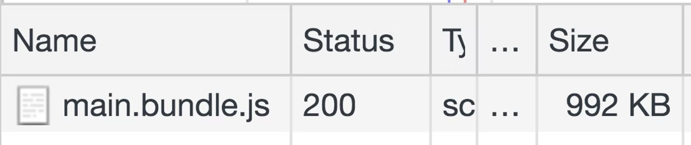
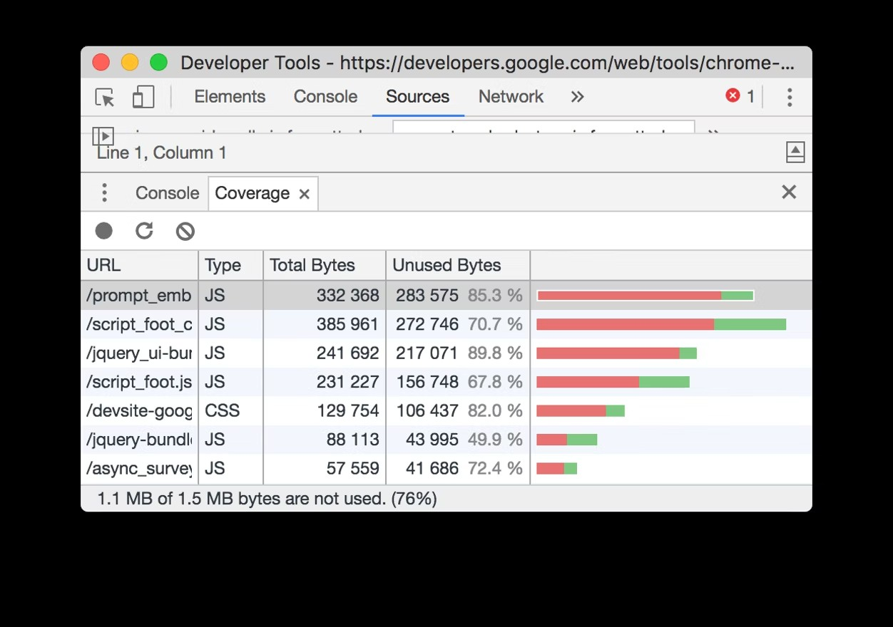
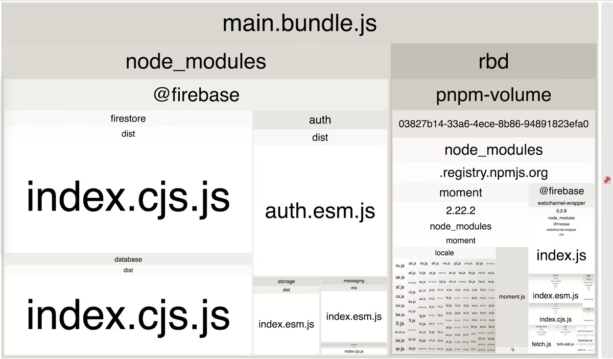

# 删除未使用的代码

像 npm 这样的仓库使 JavaScript 世界变得更美好，它们允许任何人轻松下载和使用超过 50 万个公开的软件包。但是我们经常会包含我们没有充分利用的库。要解决这个问题，请**分析您的代码包**以检测未使用的代码，然后删除**未使用**和**不需要**的库。

## 分析代码包

通过 DevTools 可以轻松查看所有网络请求的大小：

1. Press `Control+Shift+J` (or `Command+Option+J` on Mac) to open DevTools.
2. Click the Network tab.

3. Select the Disable cache checkbox.
4. Reload the page.

DevTools 中的 Coverage（覆盖）选项卡还会告诉您应用程序中有多少 CSS 和 JS 代码未使用。



通过 Node CLI 指定完整的 Lighthouse 配置后，还可以使用“未使用的 JavaScript”审计来追踪您的应用程序附带了多少未使用的代码。


如果您恰巧使用 webpack 作为打包器，Webpack Bundle Analyzer 将帮助您调查代码包的组成。像包含任何其他插件一样，将该插件包含在 webpack 配置文件中：

```javascript
module.exports = {
  //...
  plugins: [
    //...
    new BundleAnalyzerPlugin()
  ]
}
```

虽然 webpack 通常用于构建单页应用程序，但其他打包器（例如 Parcel 和 Rollup）也具有可视化工具，可用于分析代码包。

重新加载包含了此插件的应用程序，将显示整个代码包的可缩放树状图。



使用此可视化，您可以检查代码包的哪些部分比其他部分大，并更好地了解正在导入的所有库。这有助于确定是否正在使用任何未使用或不必要的库。

## 删除未使用的库

在之前的树状图中，单个 `@firebase` 域中有许多软件包。如果您的网站只需要 firebase 数据库组件，请更新导入以获取该库：

```javascript
import firebase from 'firebase';
import firebase from 'firebase/app';
import 'firebase/database';
```

需要强调的是，对于较大的应用程序，此过程要复杂得多。

对于看上去很神秘，并且您非常确定没有在任何地方使用的软件包，请退后一步，看看哪个顶级依赖项正在使用它。尝试找到一种方法仅导入您需要的组件。如果某个库用不到，则将其删除。如果初始页面加载不需要库，请考虑是否可以延迟加载。

如果您正在使用 webpack，请查看自动从流行库中删除未使用代码的插件列表。

## 删除不需要的库

并非所有库都可以轻松分解为多个部分并有选择地导入。在这些情况下，请考虑是否可以完全删除库。构建自定义解决方案或利用更轻量级的替代方案应该总是值得考虑的选项。但是，在从应用程序中完全删除库之前，权衡上述两种方案的复杂程度和工作量是很重要的。
