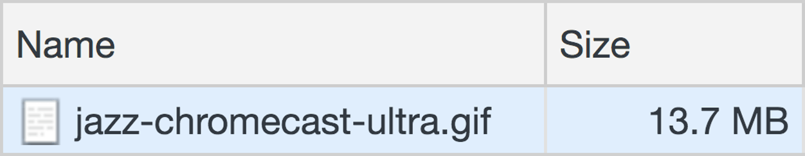
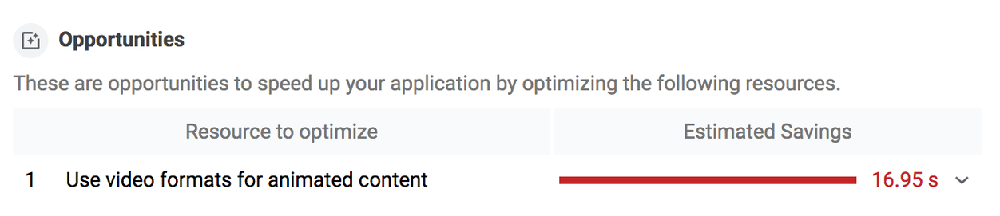
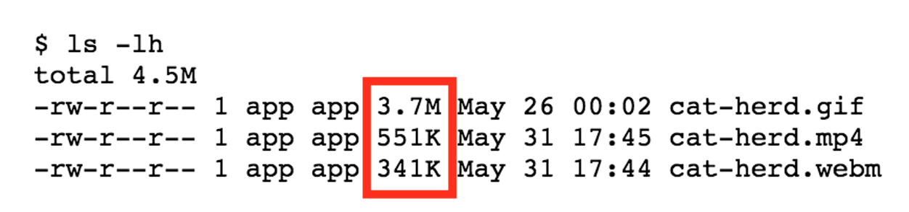

# 用视频替换 GIF 动画以加快页面加载

你有没有在 Imgur 或 Gfycat 等服务上看到过 GIF 动画，在你的开发工具中检查过它，却发现 GIF 真的是一个视频？这是有充分理由的。GIF 动画可能非常庞大。



值得庆幸的是，这是加载性能的领域之一，您可以做相对较少的工作来实现巨大的收益！**通过将大型 GIF 转换为视频，您可以节省大量用户带宽。**

## 先测量

使用 Lighthouse 检查您的网站是否有可以转换为视频的 GIF。在 DevTools 中，单击 Audits 选项卡并选中 Performance 复选框。然后运行 Lighthouse 并检查报告。如果您有任何可以转换的 GIF，您应该会看到“将视频格式用于动画内容”的建议：



## 创建 MPEG 视频

有多种方法可以将 GIF 转换为视频，FFmpeg 是本指南中使用的工具。要使用 FFmpeg 将 `my-animation.gif` 转换为 MP4 视频，请在控制台中运行以下命令：

```bash
ffmpeg -i my-animation.gif -b:v 0 -crf 25 -f mp4 -vcodec libx264 -pix_fmt yuv420p my-animation.mp4
```

通过 `-i` 选项，告诉 FFmpeg 以 `my-animation.gif` 作为输入，将其转换为 `my-animation.mp4` 视频。

libx264 编码器仅适用于具有偶数尺寸的文件，例如：320 像素 x 240 像素。如果输入 GIF 具有奇数尺寸，您可以包含一个裁剪过滤器以避免 FFmpeg 抛出“高度/宽度不能被 2 整除”错误：

```bash
ffmpeg -i my-animation.gif -vf "crop=trunc(iw/2)*2:trunc(ih/2)*2" -b:v 0 -crf 25 -f mp4 -vcodec libx264 -pix_fmt yuv420p my-animation.mp4
```

## 创建 WebM 视频

虽然 MP4 自 1999 年就出现了，但 WebM 是一种相对较新的文件格式，最初于 2010 年发布。WebM 视频比 MP4 视频小得多，但并非所有浏览器都支持 WebM，因此生成两者都是有意义的。

要使用 FFmpeg 转换 `my-animation.gif` 为 WebM 视频，请在控制台中运行以下命令：

```bash
ffmpeg -i my-animation.gif -c vp9 -b:v 0 -crf 41 my-animation.webm
```

## 比较差异

GIF 和视频之间的成本节省非常可观。



在此示例中，初始 GIF 为 3.7 MB，而 MP4 版本为 551 KB，而 WebM 版本仅为 341 KB！

## 用视频替换 GIF img

GIF 动画具有视频需要复制的三个关键特征：

- 它们自动播放
- 它们连续循环（通常，但可以防止循环）
- 他们静音

幸运的是，您可以使用 `<video>` 元素重新创建这些行为。

```html
<video autoplay loop muted playsinline></video>
```

具有这些属性的 `<video>` 元素会自动播放、无限循环、不播放音频和内联播放（即不是全屏），这些都是 GIF 动画所期望的标志性行为！

最后，该 `<video>` 元素需要一个或多个 `<source>` 子元素指向浏览器可以选择的不同视频文件，具体取决于浏览器的格式支持。同时提供 WebM 和 MP4，这样如果浏览器不支持 WebM，它可以回退到 MP4。

```html
<video autoplay loop muted playsinline>
  <source src="my-animation.webm" type="video/webm">
  <source src="my-animation.mp4" type="video/mp4">
</video>
```

浏览器不会推测哪个 `<source>` 是最优的，所以 `<source>` 的顺序很重要。例如，如果您先指定 MP4 视频并且浏览器支持 WebM，则浏览器将跳过 WebM `<source>` 而使用 MPEG-4。如果您希望 `<source>` 首先使用 WebM，请先指定它！
