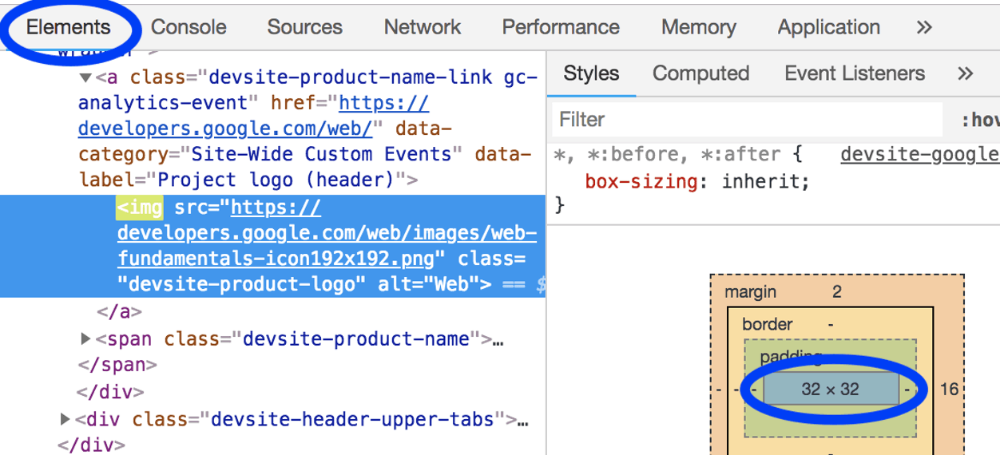

# 提供尺寸正确的图像

我们都经历过：您在将图像添加到页面之前忘记将其缩小。该图像看起来不错，但它浪费了用户的带宽并损害了页面性能。

## 识别尺寸不正确的图像

Lighthouse 可以轻松识别尺寸不正确的图像。运行性能审核（Lighthouse > Options > Performance）并查看正确大小的图像审核的结果。审核列出了需要调整大小的所有图像。

## 确定图像的正确尺寸

图像大小可能看起来很复杂。出于这个原因，我们提供了两种方法：“好”和“更好”。两者都会提高性能，但“更好”的方法可能需要更长的时间来理解和实施。但是，它也会以更大的性能改进来奖励您。对您而言，最好的选择是您觉得实施起来很舒服的选择。

### 关于 CSS 单位的快速说明

有两种类型的 CSS 单位用于指定 HTML 元素（包括图像）的大小：

- 绝对单位：使用绝对单位样式的元素将始终以相同的大小显示，而与设备无关。有效的绝对 CSS 单位示例：px、cm、mm、in。
- 相对单位：使用相对单位样式的元素将以不同的大小显示，具体取决于指定的相对长度。有效的相对 CSS 单位示例：%、vw（1vw = 视口宽度的 1%）、em（1.5 em = 1.5 倍字体大小）。

### “好”的方法

图像的尺寸基于...

- **相对单位**：将图像大小调整为适用于所有设备的大小。

您可能会发现，检查您的分析数据（例如 Google Analytics）以了解您的用户常用的显示尺寸很有帮助。或者，[screensize.es](https://screensiz.es/) 提供了许多常见设备的显示信息。

- **绝对单位**：调整图像大小以匹配其显示的大小。

DevTools Elements 面板可用于确定图像的显示尺寸。



### “更好”的方法

图像尺寸基于...

- **绝对单位**：使用 `srcset` 和 `sizes` 属性为不同的图像提供不同的显示密度。（在此处阅读有关响应式图像的指南。）

“显示密度”是指不同的显示器具有不同的像素密度。在所有其他条件相同的情况下，高像素密度显示器看起来比低像素密度显示器更清晰。

因此，如果您希望用户体验尽可能清晰的图像，无论其设备的像素密度如何，都需要多个图像版本。

有些网站发现这种图像质量的差异很重要，有些则认为不重要。

响应式图像技术允许您列出多个图像版本并让设备选择最适合它的图像，从而使这成为可能。

- **相对单位**：使用响应式图像来提供不同的图像以显示尺寸。（在这里阅读指南。）

对于较小的设备，适用于所有设备的图像将不必要地大。响应式图像技术，特别是 `srcset` 和 `sizes`，允许您指定多个图像版本并让设备选择最适合它的尺寸。

## 调整图像大小

无论您选择哪种方法，您都会发现使用 ImageMagick 调整图像大小很有帮助。ImageMagick 是最流行的用于创建和编辑图像的命令行工具。大多数人在使用 CLI 时可以比基于 GUI 的图像编辑器更快地调整图像大小。

将图像大小调整为原始大小的 25%：

```bash
convert flower.jpg -resize 25% flower_small.jpg
```

缩放图像以适应“200px 宽 x 100px 高”：

```bash
# macOS/Linux
convert flower.jpg -resize 200x100 flower_small.jpg

# Windows
magick convert flower.jpg -resize 200x100 flower_small.jpg
```

如果您要调整许多图像的大小，您可能会发现使用脚本或服务来自动化该过程会更方便。您可以在响应式图像指南中了解更多信息。

## 验证

调整所有图像的大小后，重新运行 Lighthouse 以确认您没有遗漏任何内容。
