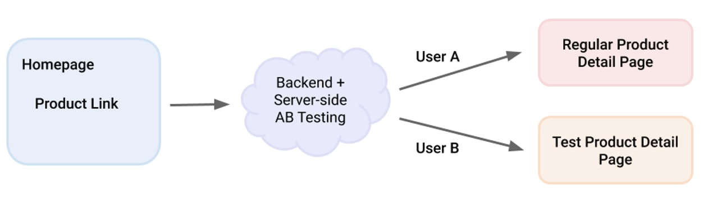
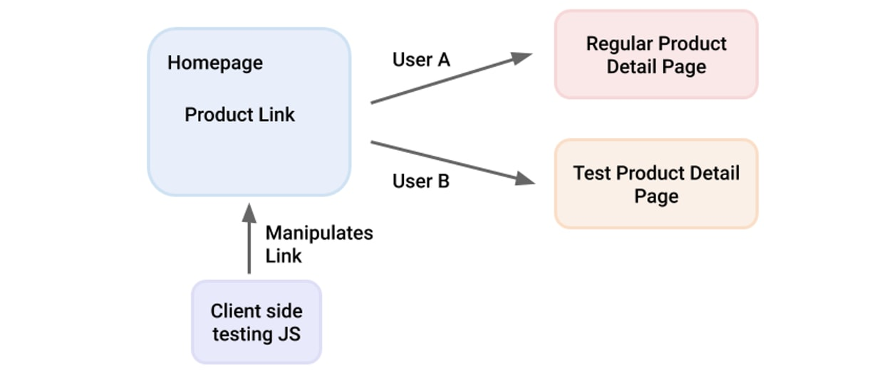

# 关联网站速度和业务指标

利用 A/B 测试来评估网站速度对您的业务指标的影响。

在过去的几年中，已经确定站点速度性能是用户体验的重要组成部分，并且改进它有利于不同的业务指标，例如转换率和跳出率。已经发表了多篇文章和案例研究来支持这一点，包括 Cloudflare 的网站性能如何影响转换率、德勤的毫秒数百万和eBay.com 上的 Shopping for Speed等等。

尽管速度的理由很明确，但许多公司仍然在努力确定可以提高网站速度的工作的优先级，因为他们不确切知道它如何影响他们的用户以及他们的业务。

在没有数据的情况下，很容易耽误站点提速工作而专注于其他任务。一种常见的情况是公司中的一些人认识到站点速度的重要性，但无法为其建立案例并说服多个利益相关者进行相应的投资。

本文提供了有关如何利用 A/B 测试来评估站点速度对业务指标的影响的高级指导，从而能够就此事做出更有效的决策。

## 第 1 步：选择一个页面进行 A/B 测试

您的目标是测试页面速度与您的业务指标相关的假设。为简单起见，您最初可以将自己限制为识别单个页面进行分析。未来的工作可以扩展到相同类型的多个页面以验证结果，然后扩展到站点的其他区域。此步骤的底部提供了一些关于从何处开始的建议。几个要求推动了页面选择过程：

- A/B 测试只能在移动用户的设备上运行。在全球范围内，我们协助的合作伙伴网站平均有超过 50%（并且还在增长！）的流量来自移动设备，但根据地区和垂直行业，这可能会显着增加。由于处理和内存限制以及网络不稳定，移动设备对速度较慢的网站更加敏感。此外，移动使用模式意味着对速度的期望更高。

- 您选择进行测试的页面应该是转化漏斗的重要组成部分。每个站点都有不同的目的，因此每个站点都会跟踪不同的成功指标。这些指标通常与使用漏斗分析的用户旅程有关。例如，电子商务网站上的用户必须浏览主页、类别页面、产品页面和结帐页面才能完成购买。如果您正在针对转化进行优化，那么其中一个页面将是一个不错的候选者。

- 该页面应该有一个单一的目的。除非您的站点有非常具体的任务，否则通常最好避免使用主页进行测试。许多商业网站的主页是各种功能的门户，这些功能会使您的分析变得嘈杂。例如，如果您要针对新闻网站上的每个会话的综合浏览量进行优化，则最好排除该网站的非商业部分并专注于获利部分和文章。

- 选择的页面应该获得足够的流量，这样您就不必等待很长时间才能获得具有统计意义的结果。

- 选择的页面应该比较慢。事实上，越慢越好。这不仅意味着您可能会更轻松地改进页面，还意味着数据应该更加清晰。您可以通过Google Analytics Speed Report或Search Console Core Web Vitals 报告进行快速扫描，以查看哪些页面最慢。

- 页面应该相对稳定。在测试完成之前不要更新页面（任何会影响业务指标的内容）。需要考虑的外部因素越少，分析就越清晰。

使用上述内容作为指导，应该更清楚哪些页面适合您的测试。广告登陆页面也是一个不错的选择，因为您可能拥有内置的业务指标、A/B 测试和分析供您使用。如果您仍然不确定，以下是每个垂直领域的一些想法：

- 内容网站：栏目、文章
- 店面：类别页面、产品页面
- 媒体播放器：视频发现/搜索页面、视频播放页面
- 服务和发现（旅行、租车、服务注册等）：初始表单输入页面

## 第 2 步：衡量绩效

衡量指标的一般方法有两种：在实验室中和在现场。我们个人发现现场测量指标（也称为真实用户监控 (RUM)）更有用，因为它反映了真实用户的体验。可以帮助您报告 RUM 数据的库和服务示例包括Perfume、Firebase 性能监控和Google Analytics Events。

有许多指标可供选择，因为它们旨在捕捉用户体验的不同方面。请记住，您的目标是最终确定您的速度和业务指标之间是否存在直接相关性，因此跟踪一些速度指标以确定哪个与您的业务成功具有最强相关性可能会很有用。一般来说，我们建议从Core Web Vitals开始。web-vitals.js库可以帮助您测量该领域的一些核心 Web Vitals，但请注意浏览器支持不是 100%。除了 Core Web Vitals 之外，其他 Web Vitals也值得一试。您还可以定义自定义指标，例如“首次广告点击时间”。

## 第 3 步：创建速度性能变体

在此阶段，您将实施更改以创建更快的页面版本，以针对当前版本进行测试。

要记住几件事：

1 避免对 UI 或 UX 进行任何更改。除了一页比另一页快之外，更改必须对用户不可见。
2 测量也是这个阶段的一个关键方面。在开发过程中，应使用 Lighthouse 等实验室测试工具来指示您的更改对性能的影响。请记住，对一个指标的更改通常会影响另一个指标。页面上线后，请坚持使用 RUM 进行更准确的评估。

创建性能变体可以通过不同的方式完成。出于测试的目的，您希望尽可能简单地这样做。下面是几个选项。

**创建更快的页面**

- 使用Squoosh之类的工具手动优化测试页上的图像
- 使用 DevTools 代码覆盖率手动消除该一页未使用的 JavaScript 或 CSS
- 高效加载第三方脚本
- 使用像Critical这样的工具来分解和内联关键 CSS
- 删除不影响用户体验的非关键 JavaScript 代码，出于测试目的您可以不使用这些代码（例如，某些第三方库）
- 实现并非所有浏览器都支持的浏览器级延迟加载，但在支持的情况下仍可显着提高性能
- 删除非关键分析标签或异步加载它们

可以在快速加载时间和前端性能检查表中找到要考虑的其他优化。您还可以使用PageSpeed Insights运行 Lighthouse，它可以识别提高性能的机会。

**减慢页面速度**

这可能是创建变体的最简单方法，可以通过添加一个简单的脚本、减慢服务器响应时间、加载更大的图像等来实现。金融时报在测试性能如何影响其业务指标时选择了这个选项：见A 更快FT.com。

**加快页面加载**

对于测试页面（比如产品详情页面）大部分是从不同页面（比如主页）链接出来的情况，直接从主页预取或预渲染测试组的产品页面将加快后续加载这一页。请注意，在这种情况下，A/B 测试拆分（第 4 步）是在主页上完成的。此外，所有这些都可能会减慢首页速度，因此请务必测量并在分析测试结果时将其考虑在内（步骤 5）。

## 第4 步：创建 A/B 测试

一旦您拥有同一页面的两个版本，其中一个比另一个更快，下一步就是拆分流量以衡量影响。一般来说，有许多技术和工具可以执行 A/B 测试，但请注意，并非所有方法都非常适合测量速度性能影响。

如果您使用的是Optimizely或Optimizely等 A/B 测试工具，我们强烈建议您设置服务器端测试而不是客户端测试，因为客户端 A/B 测试通常通过隐藏页面内容来进行，直到实验结束加载，这意味着 A/B 测试本身会扭曲您想要测量的指标。如果您只能进行客户端测试，请考虑在不同的页面上设置实验并更改指向您的测试页面的链接以分割流量。这样测试页面本身就不会被客户端测试拖下。

例子

---
通过服务器端测试在给定产品详细信息页面 (PDP) 上进行 AB 测试性能更改的示例：

请求到达后端，后端将用户分配到页面的两个不同版本。虽然这通常是一个很好的设置，但它通常需要 IT 资源来设置服务器端拆分。

这是客户端测试设置的示例，使用前一页（下图中的主页）运行测试 JavaScript：

测试 JavaScript 操作传出链接，为两个测试用户组提供指向相关 PDP 的两个版本的链接。这很容易通过常用的 A/B 测试工具（如 Optimizely 或 Optimize）进行设置和维护，并且不会影响性能测试，因为测试 JavaScript 在不同的页面上运行。

---

或者，您可以选择两个行为和执行非常相似的页面（例如，对于两个非常相似的产品）。将您的更改应用于其中之一，然后比较指标随时间的差异。这将意味着您没有进行适当的 A/B 测试，但它仍然很有洞察力。

如果您的测试页面被用作广告活动的登陆页面，则可以方便地使用广告网络的内置 A/B 测试工具，例如Facebook Ads Split Test或Google Ads Drafts & Experiments。如果这不是一个选项，您可以使用两个具有相同设置的广告系列，并将不同的着陆页设置为目标。

## 第 5 步：分析 A/B 测试

在您运行测试足够长的时间并拥有足够的数据以对结果充满信心之后，是时候将它们放在一起并运行分析了。你如何做到这一点实际上取决于测试的运行方式，所以让我们来看看这些选项。

如果您的测试是使用上述工具在广告着陆页上运行的，那么分析应该像阅读结果一样简单。如果您使用的是 Google 的草稿和实验，请查看使用记分卡的比较。

Optimizely 或 Optimizely 等平台还提供了简单的方法来解释结果并确定速度对您的页面的影响程度。

如果您使用的是 Google Analytics（分析）或类似工具，则必须自己汇总报告。幸运的是，谷歌分析可以很容易地构建自定义报告，所以这就是你应该开始的地方。如果您使用自定义维度向 Google Analytics（分析）发送了速度数据，请查看报告指南以了解如何设置这些数据并将其包含在您的自定义报告中。确保您的报告涵盖实验日期并配置为显示两种变体。这份报告应该写什么？

- 首先，您需要包括您最关心的业务指标：转化次数、页面浏览量、查看的广告、转化率、电子商务指标、点击率等。
- 此外，跳出率、平均会话持续时间和退出百分比等也可以很好地提高网站速度的其他标准页面指标。

您可能还需要针对移动设备进行过滤，并确保排除机器人和其他非用户流量。更高级的分析还将按地区、网络、设备、流量来源以及用户配置文件和类型进行过滤，例如新用户与重复访问者。每组用户可能或多或少对较慢的速度敏感，识别这些也很有帮助。

Data Studio 或其他数据可视化工具可以轻松集成各种数据源，包括 Google Analytics。这使得进行分析变得容易，并且还可以创建可与参与运行现代网站的许多利益相关者共享的仪表板，以进一步支持。例如，卫报创建了一个自动警报系统，当最近发布的内容超过他们的页面大小或速度阈值并可能导致用户不满意时，它会警告编辑团队。

## 第 6 步：得出结论并决定接下来的步骤

一旦您拥有连接性能和业务指标的数据，您就可以检查结果并开始得出结论。

如果您可以清楚地看到提高绩效和改进业务指标之间的相关性，请总结结果并在整个公司报告。既然您可以用“商业语言”来谈论速度性能，您就更有可能吸引不同利益相关者的注意力，并将网站速度性能放在每个人的雷达上。下一步是根据结果设置绩效预算，并计划工作以满足这些预算。由于您知道此类工作将提供的价值，因此您将能够相应地确定优先级。

如果您无法确定相关性，请查看以下注意事项并评估是否应在网站的其他地方运行类似的测试（例如，通过整个购买渠道或在不同类型的页面上）。

**注意事项**

在站点速度指标和业务指标之间没有发现显着相关性可能有几个原因：

- 选择的页面对您正在检查的业务指标没有足够的影响。例如，如果结帐页面非常不友好或速度很慢，则更快的产品页面可能不会对转化率产生很大影响。考虑查看更相关的指标，例如跳出率、加入购物篮率或与您正在测试的页面更直接相关的任何其他指标。
- 两个版本之间的速度差异不够显着。这应该根据您正在测量的 RUM 指标进行评估。
- A/B 测试机制有问题。流量可能未正确分配或分析未正确报告。为了排除这种情况，请考虑运行 A/A 测试，在该测试中使用相同的测试机制测试相同版本的页面，并确保这样做时结果没有差异。
- 站点速度确实不会影响您的业务指标。这种情况很少见，但可能发生在您的目标市场对速度不太敏感（例如，网站主要通过强大网络上的强大设备访问）或用户需求非常高且选择有限（例如，专门销售的票务服务高需求节目的门票）。请注意，这并不意味着更快的网站不会改善用户体验并因此影响品牌声誉。

## 结论

虽然在整个网站上启动速度优化很诱人，但从长远来看，首先了解拥有更快的网站对您的用户和您的公司意味着什么通常更有益。这就是说“我们将 FCP 提高了 1.5 秒”和“我们将 FCP 提高了 1.5 秒并且将我们的转化率提高了 5%”之间的区别。这将使您能够优先考虑进一步的工作，获得不同利益相关者的支持，并使网站速度性能成为全公司范围内的努力。
