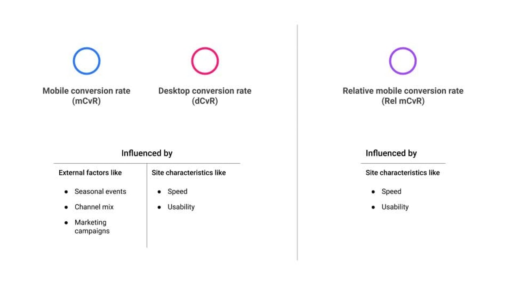
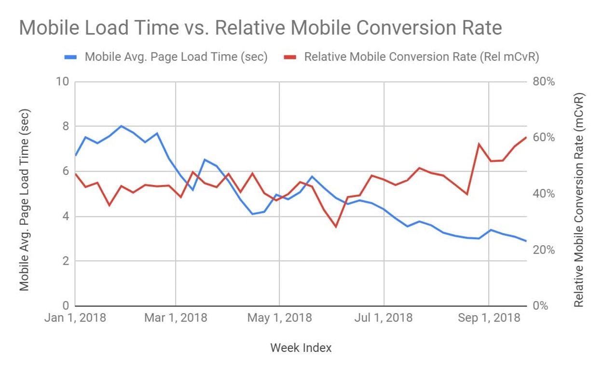
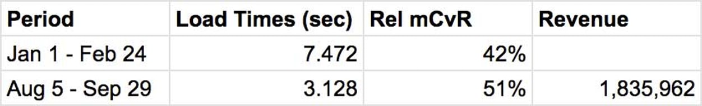
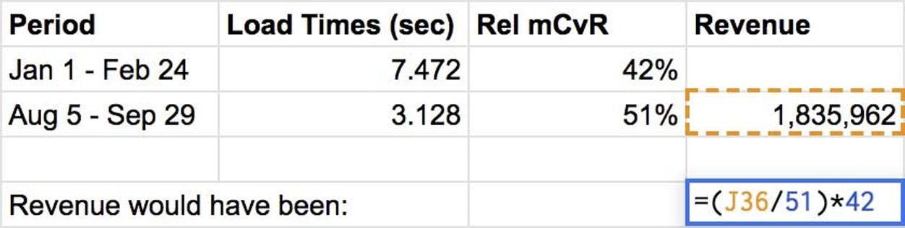
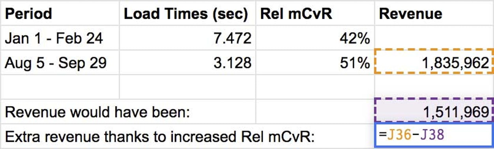
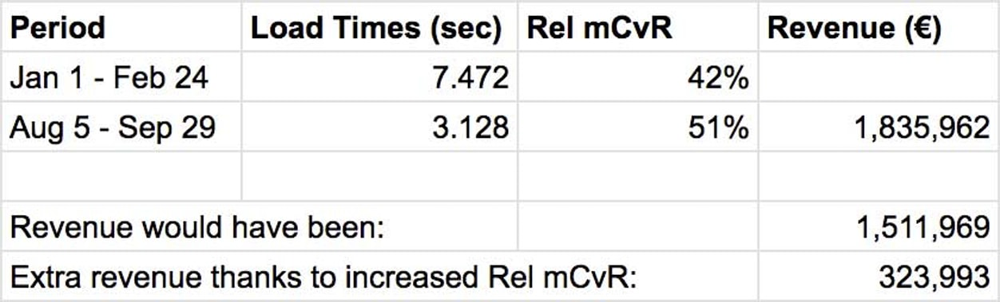

# 速度的价值

向利益相关者展示网站速度改进如何增加收入。

经过大量的努力，你已经做到了。您已经使您公司的网站明显更快。现在是有趣的部分了：向利益相关者展示您的工作产生了多少额外收入！

在这篇文章中，我们将通过计算相对移动转化率来介绍如何做到这一点。该指标很有用，因为它可以量化网站改进的效果，同时排除营销活动等外部因素，这些因素可能会掩盖您的发现。让我们开始吧！

## 相对移动转化率 (Rel mCvR)

网站的转化率会受到网站特征（如速度和可用性）以及外部因素（如营销活动、季节性事件和营销渠道组合）的影响。

当网站访问者成为客户时，就会发生转化。什么算作转化取决于网站的性质。购买产品、订阅服务、注册为用户，甚至只是查看特定页面都可以被视为一次转化。如果您不确定贵公司如何计算转化次数，请咨询您的营销团队。

由于您对网站速度如何影响转化感兴趣，因此移动网站是最相关的——您最有可能看到提高速度的好处。但是，您将分析相对移动转化率 (Rel mCvR)，而不是单独查看移动转化率，该转化率是通过将移动转化率除以桌面转化率计算得出的。这种方法减少了来自外部因素的噪音，这些因素往往会影响桌面和移动设备，并且更容易看出移动网站效率的任何提高是否实际上是由速度提高引起的。

**警告**

注意：Rel mCvR 不仅受速度的影响，还受其他站点特性（如可用性）的影响。如果在您要分析的期间对站点进行了其他重大更改，您将无法单独衡量速度改进的效果，但您可以展示所有改进作为一个整体的好处

## 进行分析

确保您有权访问您网站的 Google Analytics，或与分析团队合作。如果您没有 Google Analytics 帐户，可以在开始使用Google Analytics 中了解如何设置帐户。

第 1 步：转到 Google Analytics 并点击Admin。在查看下，选择查看设置。在那里，复制视图 ID。

第 2 步：转到此电子表格并单击文件，然后复制。

第 3 步：将来自 Google Analytics 的视图 ID 插入电子表格中的B3、C3和D3字段。如果您的 Google Analytics（分析）有目标而不是电子商务转化率，请更改字段B6和C6，以便您删除并改为在这两个字段中输入。ga:transactionsPerSessionga:goalConversionRateAll

第 4 步：在电子表格中，点击Add-ons、Google Analytics，然后选择Run reports。然后转到电子表格页面 Rel mCvR 并查看结果。

您现在应该有一个看起来像这样的图表：

第 6 步：使用图表，确定您要分析的速度优化之前的时间段（加载时间较高时）和速度优化之后的时间段（加载时间应该较低的时间段）。在此示例中，您会将 1 月至 2 月的八周与 8 月至 9 月的八周进行比较。

第 7 步：在新工作表中，计算两个时段的平均加载时间和 rel mCvR。然后添加速度优化后（示例中为 8 月至 9 月）期间来自移动访问者的收入。您可以在 Google Analytics（分析）中的 Audience > Mobile > Overview 部分下找到收入数据。

第 8 步：现在计算如果 Rel mCvR 没有改善，收入会是多少。通过将收入 (1,835,962 欧元) 除以当前 Rel mCvR (51%) 并乘以速度优化前时期的 Rel mCvR (42%) 来做到这一点。

第 9 步：如果 Rel mCvR 没有改善，公司将获得的收入减去公司获得的收入。

在这个例子中，由于 Rel mCvR 的改进，该公司在八周内额外赚取了 323,993 欧元——也就是说，这要归功于移动网站变得更快。

## 分析 Rel mCvR 时要考虑的事项

如上所述，对站点的其他更改（例如 UX 改进）可能会影响 Rel mCvR。

- 检查速度是您想学习期间网站的唯一重大变化。如果有其他更改，Rel mCvR 可以告诉您更改作为一个组的影响，而不是单个更改的影响。
- 注意影响桌面网站但不影响移动网站的任何更改或事件——它们可能会扭曲您的结果。如果您发现任何仅限桌面的更改，请从分析中忽略受影响的时间段。
- 您可能想知道 Rel mCvR 的增加是否是由于从桌面设备到移动设备的转化而不是整体转化的增加。虽然由于速度的提高，桌面和移动转化的组合可能会发生一些变化，但请记住，Rel mCvR 计算的是相对于桌面转化率的移动转化率。因此，只有当 mCvR 上升超过 dCvR 时，您才会看到 Rel mCvR 的增加。换句话说，在进行此计算时，您的计数已经很低，这意味着您有一个安全余量，可以补偿渠道组合中的任何变化。

## 总结

虽然它有一些限制，但 Rel mCvR 是一种很好的低成本方法，可以估计速度优化增加了多少收入，而无需运行服务器端或减速测试。量化绩效和收入之间的关系可以帮助您展示开发项目的价值，这些项目的好处可能对非技术利益相关者来说并不明显。
