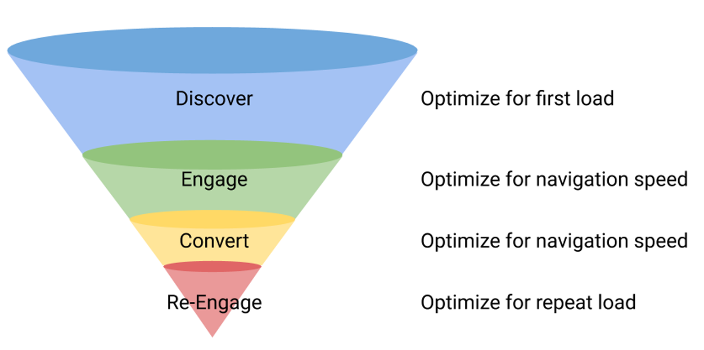
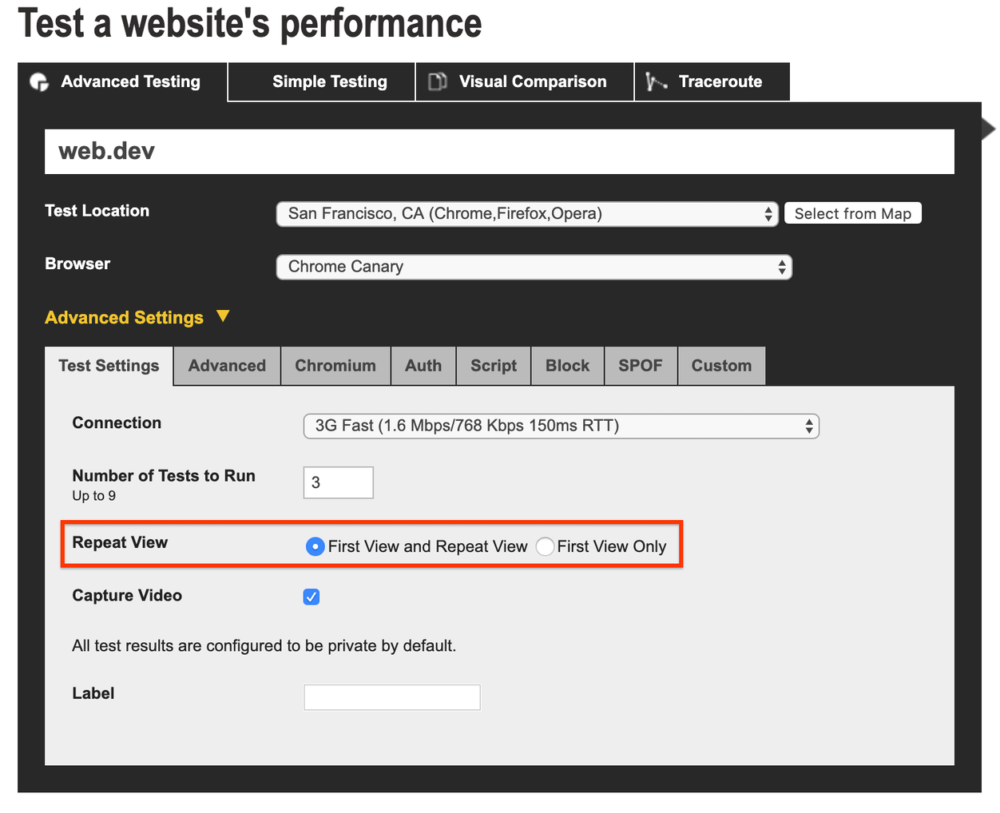
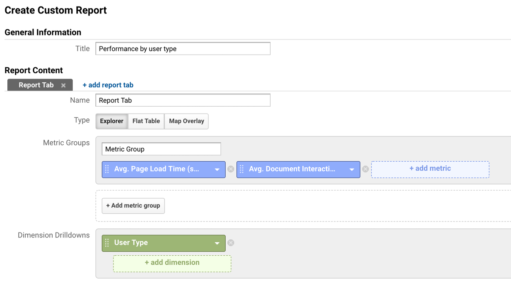

# 你应该测量什么来提高性能？

在购买漏斗的每个阶段衡量绩效的策略。

购买漏斗的不同步骤容易以不同的方式出现性能问题，因此需要不同的衡量和优化：



在本指南中，我们将讨论如何测量不同的步骤。为此，我们建议您查看实验室和现场数据。

**实验室数据**是通过在本地运行测试来收集的，例如使用Lighthouse和其他工具。这可以通过受控、稳定的环境来比较网站性能随时间变化并与竞争对手进行比较，但它可能不能代表用户在现实生活中体验到的性能。

**现场数据**是通过分析从真实用户那里收集的，因此可以代表他们的经验。但是，随着时间的推移或与竞争对手的比较，它不容易进行比较。网络连接和智能手机硬件随着时间的推移而发展，不同的目标受众可能拥有不同的设备，因此很难与现场数据进行比较。另请参阅测量现场绩效。

要获得完整的图片，需要两个数据源。以下部分展示了如何为整个漏斗中的不同相关性能标记收集实验室和现场数据。

## 发现

优化发现意味着优化首次加载，这是新用户将获得的，还有搜索和社交爬虫。首次加载的实验室数据可以通过Lighthouse轻松获取，而现场数据（至少对于 Chrome）可以通过Chrome UX 报告轻松获得。可以在PageSpeed Insights中找到两者的便捷组合。您还应该自己跟踪现场的相关指标：在真实用户的设备上测量这些指标可以提供一个很好的概览。

从用户的角度来看，最重要的指标是：

- First Contentful Paint (FCP)：用户盯着空白屏幕的时间。这是大多数用户反弹的时候，因为他们看不到进展。
- 第一次有意义的绘画（FMP）：当用户开始看到他们想要的主要内容时。这通常是主图，但对于登录页面，它甚至可能是号召性用语，例如购买按钮，因为用户可能带着明确的意图到达（例如，通过有针对性的广告活动）。
- 首次输入延迟 (FID)：网站需要对用户的首次输入做出反应的时间。过多的 JavaScript 和其他资产加载问题可能会阻止这一点，导致点击或点击失败、错误输入和页面放弃。

您可以查看更多指标，但这些是一个很好的基准。此外，还要确保捕获跳出率、转化率和用户参与度，以便您可以对这些进行设置。

## 参与和转化

首次加载着陆页后，用户将继续浏览您的网站，并有望实现成功转换。

在这个阶段，拥有快速响应的导航和交互非常重要。不幸的是，测量现场导航和交互事件的完整流程并非易事，因为每个用户在页面中采用不同的路径。因此，我们建议通过在实验室测试中编写脚本和测量流程来测量转换或转换子目标（“行动时间”）所需的时间，以比较一段时间内的性能或与竞争对手的性能。

有两种方便的方法可以做到这一点：

## 网页测试

WebPageTest提供了一个非常灵活的脚本解决方案。基本思想是：

- 告诉 WebPageTest 使用命令浏览流的页面navigate。
- clickAndWait如果需要，可以通过命令编写单击按钮的脚本，并通过setValue. 对于单页应用程序的测试，在第一步之后的所有步骤中使用clickAndWait而不是navigate命令，因为navigate将执行完整加载而不是轻量级虚拟页面加载。
- 确保在分析中结合流程的不同步骤，combineSteps以生成完整流程的单一整体结果报告。
这样的脚本可能如下所示：

```
combineSteps
navigate  https://www.store.google.com/landingpage
navigate  https://www.store.google.com/productpage
clickAndWait  innerText=Buy Now
navigate  https://www.store.google.com/basket
navigate  https://www.store.google.com/checkout
```

有了这样的脚本，您可以轻松地测量和比较一段时间内的性能。这甚至可以通过 WebPageTest API 自动化。

## 傀儡师

脚本测试的另一个不错的选择是通过无头 Chrome，它可以通过 Node API Puppeteer进行控制。总体思路是通过 Puppeteer 启动浏览器，通过goto函数导航到登录页面，注入 JavaScript以填充字段或单击按钮，并根据需要通过进一步的goto调用通过漏斗继续。

作为度量，可以直接测量流的持续时间，但您也可以将流的各个负载的 FCP、FMP 或 TTI 值相加。使用 Puppeteer 测试网站性能概述了如何通过 Puppeteer 获取性能指标。一个非常简化的示例节点脚本可能如下所示：

```javascript
const puppeteer = require('puppeteer');
(async () => {
  const browser = await puppeteer.launch();
  const page = await browser.newPage();
  const start = performance.now();
  await page.goto('https://www.store.google.com/landingpage');
  await page.goto('https://www.store.google.com/productpage');
  // click the buy button, which triggers overlay basket
  await page.click('#buy_btn');
  // wait until basket overlay is shown
  await page.waitFor('#close_btn');
  await page.goto('https://www.store.google.com/basket');
  await page.goto('https://www.store.google.com/checkout');
  console.log('Flow took ' + parseInt((performance.now() - start)/1000) + ' seconds');
  await browser.close();
})();
```

该脚本可以轻松实现自动化，甚至可以作为构建过程或性能预算的一部分，并定期进行监控。

## 重新参与

用户将在不同的时间间隔返回您的站点。根据经过的时间，浏览器可能缓存的网站资源较少，需要更多的网络请求。这使得很难估计实验室测试中重复访问之间的性能差异。尽管如此，仍然建议密切关注这一点，一个很好的重复访问实验室测试工具是 WebPageTest，它有一个专门用于直接重复访问的选项：



为了更好地了解该领域的重复访问性能，请使用您选择的分析包按用户类型细分您的性能指标。以下是 Google Analytics 中此类报告的示例：



像这样的报告还将为您提供新用户和回访用户的页面加载时间。

## 回顾

本指南向您展示了如何通过现场和实验室测试测量首次负载、流量和重复负载。确保相应地优化漏斗的不同步骤，以最大化发现（首次加载）、参与（导航和流程）和重新参与（重复加载）。
