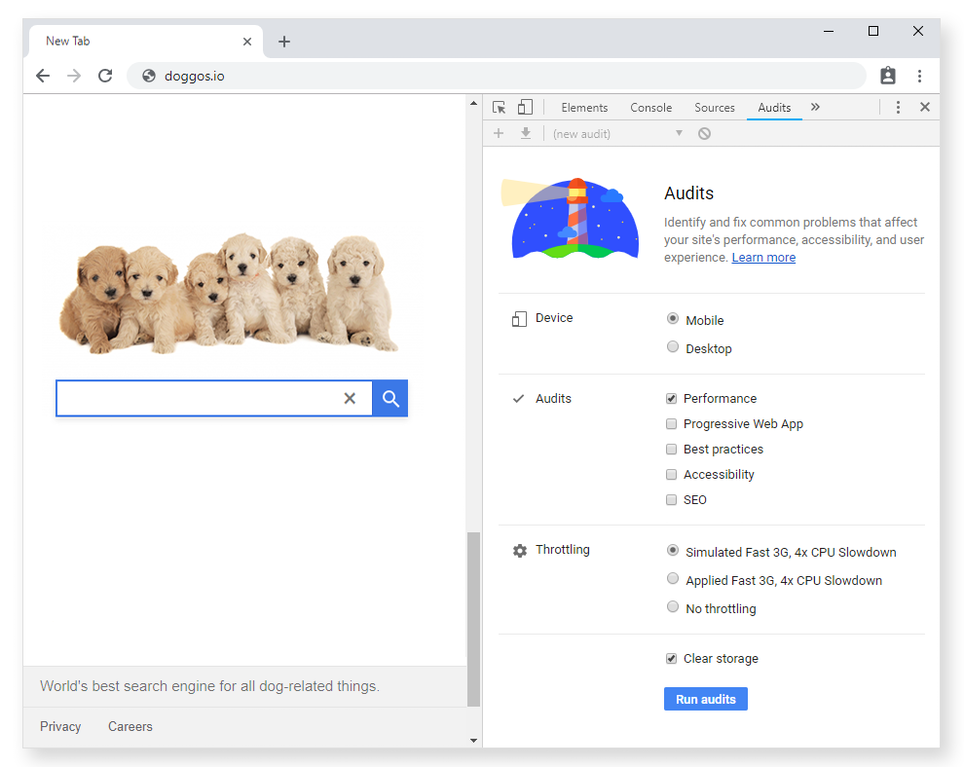
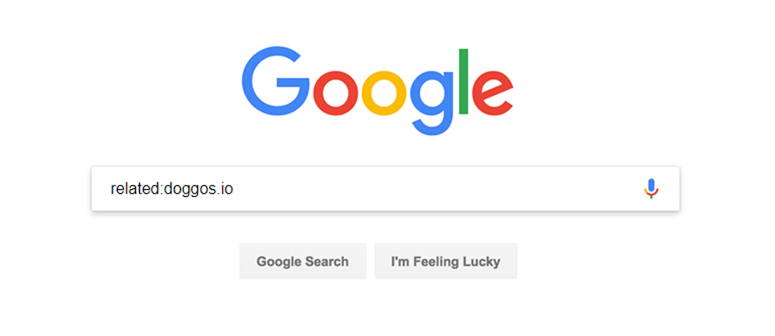
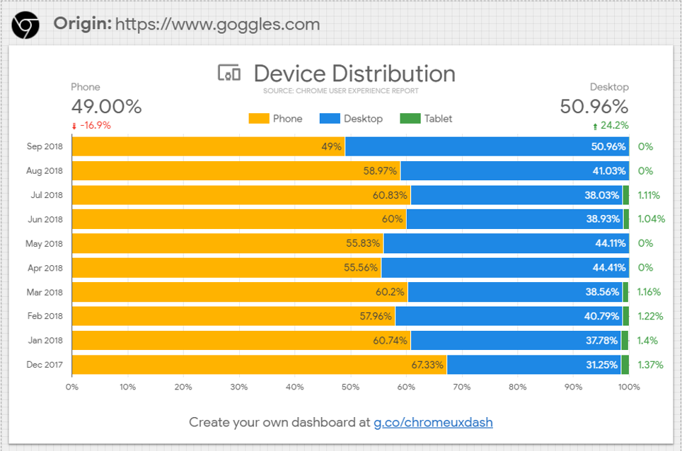

# 你的第一个性能预算

When you set a personal, business or family budget, you are setting a limit to your spending and making sure you stay within it. Performance budgets work in the same way, but for metrics that affect website performance.

With a performance budget established and enforced you can be sure that your site will render as quickly as possible. This will provide a better experience for your visitors and positively impact business metrics.

Here's how to define your first performance budget in a few simple steps.

当您设置个人、企业或家庭预算时，您是为支出设置限制，并确保保持在限额内。效果预算的工作方式相同，但适用于影响网站性能的指标。

通过建立并强制执行性能预算，您可以确保您的网站将尽快呈现。这将为您的访问者提供更好的体验，并对业务指标产生积极影响。

下面介绍了如何通过几个简单的步骤定义您的第一个效果预算。

## Preliminary analysis
初步分析

If you are trying to improve the performance of an existing site, start by identifying the most important pages. For example, these could be pages that have the highest amount of user traffic or a product landing page.

After you identify your key pages, it's time to analyze them. First, we'll focus on the timing milestones that best measure the user experience.

Under the Audits panel in Chrome DevTools, you'll find Lighthouse. Run audits on each page in a Guest window to record these two times:

如果要尝试提高现有网站的性能，请首先确定最重要的页面。例如，这些网页可能是用户流量最高的网页或商品着陆页。

确定关键页面后，是时候对其进行分析了。首先，我们将重点介绍最能衡量用户体验的计时里程碑。

在Chrome DevTools的"审核"面板下，您将找到Lighthouse。对"来宾"窗口中的每个页面运行审核以记录以下两个时间：

- First Contentful Paint (FCP)
- Time to Interactive (TTI)

Using a Guest window gives you a clean testing environment without any Chrome extensions that could interfere with the audit.
使用"来宾"窗口可为您提供一个干净的测试环境，没有任何可能干扰审核的 Chrome 扩展程序。

Lighthouse panel in Chrome DevTools

Let's take a highly specialized search engine, Doggos.com, as an example. Doggos.com aims to index all dog-related things on the internet, and its most important pages are the home and results pages. Here are the FCP and TTI numbers measured for the site on desktop and mobile.
让我们以一个高度专业化的搜索引擎 Doggos.com 为例。Doggos.com 旨在索引互联网上所有与狗有关的内容，其最重要的页面是主页和结果页面。以下是在桌面和移动设备上为该网站测量的FCP和TTI数字。

Desktop	FCP	TTI
Homepage	1,680 ms	5,550 ms
Results page	2,060 ms	6,690 ms
Desktop analysis of Doggos.com
Mobile	FCP	TTI
Homepage	1,800 ms	6,150 ms
Results page	1,100 ms	7,870 ms
Mobile analysis of Doggos.com

## 竞品分析

Once you've analyzed your own site, it's time to analyze your competitors' sites. Comparing results from websites similar to yours is a great way to figure out a performance budget. Whether you are working on an established project or starting from scratch, this is an important step. You get competitive advantage when you are faster than your competitors.

If you are not sure which sites to look at, here are a few tools to try:
一旦你分析了自己的网站，是时候分析竞争对手的网站了。比较来自与您的网站类似的网站的结果是计算性能预算的好方法。无论您是在处理已建立的项目还是从头开始，这都是重要的一步。当您比竞争对手更快时，您将获得竞争优势。

如果您不确定要查看哪些网站，可以尝试以下工具：

Google search's "related:" keyword
Alexa's similar sites feature
SimilarWeb

Screenshot of Google search with the related keyword
For a realistic picture, try to find 10 or so competitors.
为了获得逼真的图片，请尝试找到10个左右的竞争对手。

## Budget for timing milestones
时间安排里程碑的预算

Our niche search engine in this example has a handful of competitors and we'll focus on optimizing the homepage for mobile devices. Over half of the internet traffic today happens on mobile networks and using mobile numbers as default will benefit not only your mobile users, but your desktop users as well.

Create a chart with FCP and TTI times for all the similar websites and highlight the fastest in the bunch. A chart like this one gives you a clearer picture of how your website is doing compared to the competition.
在这个例子中，我们的利基搜索引擎有一些竞争对手，我们将专注于优化移动设备的主页。如今，超过一半的互联网流量发生在移动网络上，使用手机号码作为默认号码不仅会使您的移动用户受益，还会使您的桌面用户受益。

为所有类似的网站创建一个包含FCP和TTI时间的图表，并突出显示其中最快的网站。像这样的图表可以让您更清楚地了解您的网站与竞争对手相比的表现。

Site/Homepage	FCP	TTI
goggles.com	880 ms	3,150 ms
Doggos.com	1,800 ms	6,500 ms
quackquackgo.com	2,680 ms	4,740 ms
ding.xyz	2,420 ms	7,040 ms

Competitive analysis of Doggos.com on 3G network

Doggo at a computer
Doggos.com seems to be doing okay on the FCP metric but seriously lagging behind in TTI
There's room for improvement and a good guideline for that is the 20% rule. Research states that users recognize a difference in response times when it's greater than 20%. This means that if you want to be noticeably better than the best comparable site, you have to be at least 20% faster.
还有改进的余地，一个很好的指导方针是20%规则。研究表明，当响应时间大于 20% 时，用户会识别出响应时间的差异。这意味着，如果你想明显优于最好的可比网站，你必须至少快20%。

Measure	Current time	Budget (20% faster than competition)
FCP	1,800 ms	704 ms
TTI	6,500 ms	2,520 ms
Performance budget that would get Doggos.com ahead of the competition
If you are trying to optimize an existing site that goal may seem impossible to reach. This is not a sign for you to give up. Start with small steps and set a budget at 20% faster than your current speed. Keep optimizing from there.

For Doggos.com, a revised budget could look like this.

Measure	Current time	Initial budget (20% faster than the current time)	Long-term goal (20% faster than competition)
FCP	1,800 ms	1,440 ms	704 ms
TTI	6,500 ms	5,200 ms	2,520 ms
Revised Doggos.com performance budget

## 组合不同的指标

A solid performance budget combines different types of metrics. We've already defined the budget for milestone timings and now we'll add two more to the mix:
稳健的效果预算结合了不同类型的指标。我们已经为里程碑时间定义了预算，现在我们将再添加两个：

- 基于数量的指标
- 基于规则的指标

### 基于数量的指标的预算

Whatever total page weight number you come up with, try to deliver under 170 KB of critical-path resources (compressed/minified). This guarantees your website will be fast even on inexpensive devices and slow 3G.

You can have a bigger budget for the desktop experience, but don't go wild. The median page weight on both desktop and mobile is over 1MB according to the HTTP Archive data for the last year. To get a performant website you have to aim well below these median numbers.

Here are a few examples based on TTI budgets:
无论您想出什么总页码，尝试提供低于 170 KB 的关键路径资源（压缩/缩小）。这保证了您的网站即使在廉价设备和慢速3G上也能快速运行。

您可以为桌面体验提供更大的预算，但不要疯狂。根据去年的HTTP Archive数据，桌面和移动设备上的页面权重中位数都超过1MB。要获得一个高性能的网站，你必须瞄准远低于这些中位数。

以下是一些基于TTI预算的示例：

Network	Device	JS	Images	CSS	HTML	Fonts	Total	Time to Interactive budget
Slow 3G	Moto G4	100	30	10	10	20	~170 KB	5s
Slow 4G	Moto G4	200	50	35	30	30	~345 KB	3s
WiFi	Desktop	300	250	50	50	100	~750 KB	2s
The recommended sizes are for the critical-path resources.
建议的大小适用于关键路径资源。

Defining a budget based on quantity metrics is a tricky business. An e-commerce website with loads of product photos is very different from a news portal which is mostly text. If you have ads or analytics on your site, that increases the amount of JavaScript you're shipping.

Use the table above as a starting point and adjust based on the type of content you are working with. Define what your pages will include, review your research and take an educated guess for individual asset sizes. For example, if you are building a website with a lot of images, put stricter limits to JS size.

Once you have a working website, check how you are doing on user-centric performance metrics and adjust your budget.
根据数量指标定义预算是一项棘手的业务。带有大量产品照片的电子商务网站与主要是文本的新闻门户非常不同。如果您的网站上有广告或分析，则会增加您发布的JavaScript数量。

使用上表作为起点，并根据您正在处理的内容类型进行调整。定义您的网页将包含的内容，查看您的研究，并对各个资产大小进行有根据的猜测。例如，如果您正在构建一个包含大量图像的网站，请对JS大小进行更严格的限制。

一旦你有了一个有效的网站，检查你在以用户为中心的性能指标上的表现，并调整你的预算。

### 基于规则指标的预算

Very effective rule-based metrics are Lighthouse scores. Lighthouse grades your app in 5 categories and one of those is performance. Performance scores are calculated based on 5 different metrics, including First Contentful Paint and Time to Interactive.

When you try to build a great site, set Lighthouse performance score budget to at least 85 (out of 100). Use Lighthouse CI to enforce it on pull-requests.
非常有效的基于规则的指标是灯塔分数。Lighthouse 将你的应用分为 5 个类别，其中之一就是性能。性能得分是根据 5 个不同的指标计算得出的，包括"首次内容画图"和"互动时间"。

当您尝试构建一个出色的网站时，请将 Lighthouse 性能分数预算设置为至少 85（满分 100 分）。使用 Lighthouse CI 在拉取请求上强制执行它。

## Prioritize

Ask yourself what level of interaction you expect on your site. If it's a news website, users' primary goal is to read content so you should focus on rendering quickly and keeping FCP low. Doggos.com visitors want to click on relevant links as soon as possible, so the top priority is low TTI.

Find out exactly what part of your audience browses on desktop vs. on mobile devices and prioritize accordingly. One way to figure this out is to check what your audience is doing on competitors' websites, through the Chrome User Experience report dashboard.
问问自己，您希望在网站上进行什么级别的互动。如果它是一个新闻网站，用户的主要目标是阅读内容，所以你应该专注于快速渲染并保持低FCP。Doggos.com 访问者希望尽快点击相关链接，因此首要任务是低TTI。

准确了解您的受众群体在桌面设备上浏览的受众群体与移动设备上浏览的受众群体，并相应地确定优先级。要弄清楚这一点，一种方法是通过 Chrome 用户体验报告信息中心来检查受众在竞争对手的网站上做了什么。

Device distribution data from Chrome User Experience report
Device distribution data from Chrome User Experience report

## 下一步

Make sure your performance budget is enforced throughout the project and incorporate it into your build process.
确保在整个项目中强制执行性能预算，并将其纳入构建过程。
