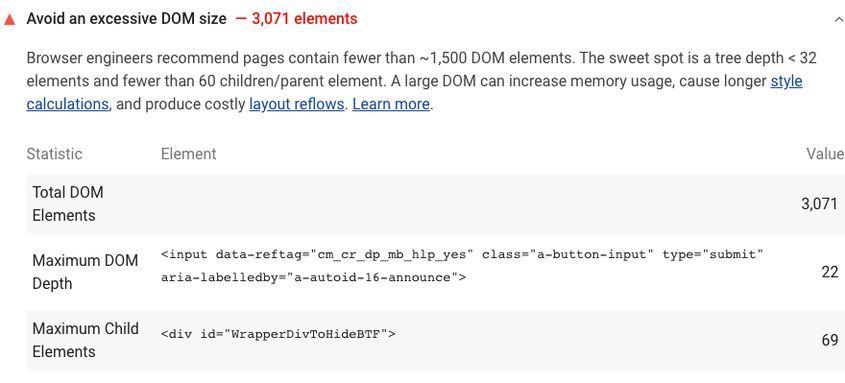

大型 DOM 树可能会以多种方式降低页面性能：

###网络效率和加载性能

大型 DOM 树通常包含许多在用户首次加载页面时不可见的节点，这会增加用户的数据成本和减慢加载速度，但其实并非必要。

###运行时性能

当用户和脚本与页面交互时，浏览器必须不断重新计算节点的位置和样式。大型 DOM 树与复杂的样式规则相结合，会严重减慢渲染速度。

###内存性能

如果 JavaScript 使用通用查询选择器，例如 document.querySelectorAll('li')，您可能会在不知不觉中存储对大量节点的引用，这可能会严重超出用户设备的内存容量。

#Lighthouse DOM 大小审核为何失败
Lighthouse 会报告页面的总 DOM 元素数量，页面的最大 DOM 深度及其最大子元素：

Lighthouse 避免 DOM 过大审核的截图
Lighthouse 使用 DOM 树标记页面：

当 body 元素有超过约 800 个节点时发出警告。
当 body 元素有超过约 1400 个节点时出错。
See the Lighthouse performance scoring post to learn how your page's overall performance score is calculated.

#如何优化 DOM 大小
通常，仅在需要时才创建 DOM 节点，当不再需要时，应销毁节点。

如果您当前正在传送大型 DOM 树，请尝试加载您的页面并注意显示了哪些节点。也许您可以从最初加载的文档中删除未显示的节点，而仅在发生相关的用户交互（例如，滚动或单击按钮）之后创建这些节点。

如果您在运行时创建 DOM 节点， 子树修改 DOM 更改断点可以帮助您确定创建节点的时间。

如果无法避免使用大型 DOM 树，另一种提高渲染性能的方法是简化 CSS 选择器。有关更多信息，请参阅 Google 的减小样式计算的范围和复杂性。

#针对堆栈的具体指导
##Angular
如果要渲染大型列表，请使用组件开发工具包 (CDK) 中的虚拟滚动。

##React
如果在页面上渲染许多重复元素，react-window 之列的“窗口化”库可以最大限度减少创建的 DOM 节点的数量。
使用 shouldComponentUpdate、PureComponent 或 React.memo 最大限度减少非必要的重新渲染。
如果使用 Effect 挂钩来提高运行时性能，则仅在某些依赖项发生更改后跳过效果。
##资源

！[减小样式计算的范围和复杂性](https://developers.google.com/web/fundamentals/performance/rendering/reduce-the-scope-and-complexity-of-style-calculations)
