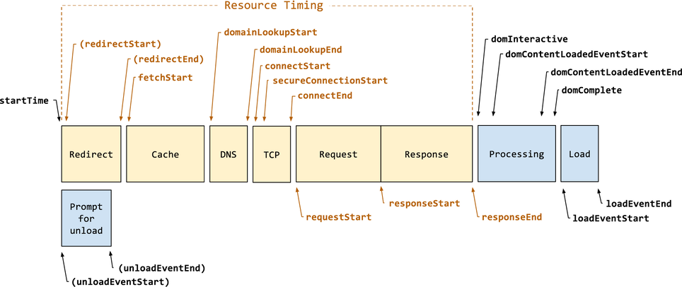

# 性能

网站性能描述页面加载的速度以及用户交互的响应速度。Lighthouse 性能评分主要由六个性能指标得分计算而来，六个性能指标分别是：FCP、SI、LCP、TTI、TBT 和 CLS。

## 常用性能指标

### FCP

FCP (First Contentful Paint) 是指渲染出首个文本或首张图片的时间。

FCP 评分标准如下：

| FCP 时长 (单位：秒) | 颜色 |
| --- | --- |
| 0 ~ 1.8 | 绿色 (优) |
| 1.8 ~ 3 | 橙色 (中) |
| > 3     | 红色 (差) |

通常对 FCP 得分的影响最大的是字体加载时间。[确保字体文件加载时页面文字可见](performance/font-display.md)，文中有减少字体加载时间的办法。

### SI

SI (Speed Index) 是指网页内容多长时间后可见。

SI 评分标准如下：

| SI 时长 (单位：秒) | 颜色 |
| --- | --- |
| 0 ~ 3.4   | 绿色 (优) |
| 3.4 ~ 5.8 | 橙色 (中) |
| > 5.8     | 红色 (差) |

以下三方面的措施，会极大提升网站的 SI 得分：

- [最少化主线程工作](performance/mainthread-work-breakdown.md)
- [减少 JavaScript 执行时间](performance/bootup-time.md)
- [确保字体文件加载时页面文字可见](performance/font-display.md)

### LCP

LCP (Largest Contentful Paint) 是指渲染出最大文本或图片的时间。

LCP 评分标准如下：

| LCP 时长 (单位：秒) | 颜色 |
| --- | --- |
| 0 ~ 2.5 | 绿色 (优) |
| 2.5 ~ 4 | 橙色 (中) |
| > 4     | 红色 (差) |

### TTI

TTI (Time to Interactive) 是指网页多长时间后才能完全可交互。

TTI 评分标准如下：

| TTI 时长 (单位：秒) | 颜色 |
| --- | --- |
| 0 ~ 3.8   | 绿色 (优) |
| 3.8 ~ 7.3 | 橙色 (中) |
| > 7.3     | 红色 (差) |

一个对 TTI 分值会产生很大影响的改进是推迟加载或删除不必要的 JavaScript 代码。

以下几个方面也可以有效提升网站的 TTI 分值：

- [最少化主线程工作](performance/mainthread-work-breakdown.md)
- [减少 JavaScript 执行时间](performance/bootup-time.md)

### TBT

TBT (Total Blocking Time) 测量页面阻止响应用户输入（例如：鼠标点击、屏幕点击或按下键盘）的总时间。总和是 FCP 和 TTI 之间所有长任务的阻塞部分之和。任何执行时间超过 50 毫秒的任务都是长任务，50 毫秒后的时间量是阻塞部分。

TBT 评分标准如下：

| TBT 时长 (单位：毫秒) | 颜色 |
| --- | --- |
| 0 ~ 200   | 绿色 (优) |
| 200 ~ 600 | 橙色 (中) |
| > 600     | 红色 (差) |

### CLS

CLS (Cumulative Layout Shift) 测量的是整个页面生命周期内发生的所有单次布局偏移分数的总和。

CLS 评分标准如下：

| CLS | 颜色 |
| --- | --- |
| 0 ~ 0.1    | 绿色 (优) |
| 0.1 ~ 0.25 | 橙色 (中) |
| > 0.25     | 红色 (差) |

## 性能评分

Lighthouse 网站性能评分由上面六个性能指标得分计算出来。六个性能指标得分的权重如下：

| 指标 | 权重 |
| --- | --- |
| FCP: First Contentful Paint   | 10% |
| SI: Speed Index               | 10% |
| LCP: Largest Contentful Paint | 25% |
| TTI: Time to Interactive      | 10% |
| TBT: Total Blocking Time      | 30% |
| CLS: Cumulative Layout Shift  | 15% |

## 其他性能指标

### TTFB

TTFB (Time to First Byte) 测量的是从发出资源请求到接收到响应的第一个字节耗费的时长。TTFB 会影响 FCP 和 LCP 的评分。

如上图所示，TTFB 是从 startTime 到 responseStart 之间的时长。TTFB 由以下几部分组成：

- 网站重定向时间
- Service worker 启动时间（如果有 Service worker）
- DNS 查询
- TCP 三次握手建立连接
- 从 HTTP 请求的发出至收到第一个响应字节

### FID

FID (First Input Delay) 测量交互性。为了提供良好的用户体验，页面的 FID 应为 100 毫秒或更短。

### FPS

FPS (Frames per Second)

## 性能优化手段

- [删除阻塞渲染的资源](render-blocking-resources.md)
- [Properly size images](performance/uses-responsive-images.md)
- [Defer offscreen images](performance/offscreen-images.md)
- [压缩 CSS](performance/unminified-css.md)
- [压缩 JavaScript](performance/unminified-javascript.md)
- [删除未使用的 CSS](performance/unused-css-rules.md)
- [对图像进行高效编码](performance/uses-optimized-images.md)
- [Serve images in modern formats](performance/uses-webp-images.md)
- [启用文本压缩](performance/uses-text-compression.md)
- [预连接到所需的源](performance/uses-rel-preconnect.md)
- [Reduce server response times (TTFB)](performance/time-to-first-byte.md)
- [避免多个页面重定向](performance/redirects.md)
- [Preload key requests](performance/uses-rel-preload.md)
- [Use video formats for animated content](performance/efficient-animated-content.md)
- [Reduce the impact of third-party code](performance/third-party-summary.md)
- [避免非合成动画](performance/non-composited-animations.md)
- [使用 Facade （外观）延迟加载第三方资源](performance/third-party-facades.md)
- [避免巨大的网络有效负载](performance/total-byte-weight.md)
- [Serve static assets with an efficient cache policy](performance/uses-long-cache-ttl.md)
- [避免 DOM 过大](performance/dom-size.md)
- [避免链接关键请求](performance/critical-request-chains.md)
- [User Timing marks and measures](performance/user-timings.md)
- [减少 JavaScript 执行时间](performance/bootup-time.md)
- [Minimize main thread work](performance/mainthread-work-breakdown.md)
- [Ensure text remains visible during webfont load](performance/font-display.md)
- [Keep request counts low and transfer sizes small](rmance/resource-summary.md)
