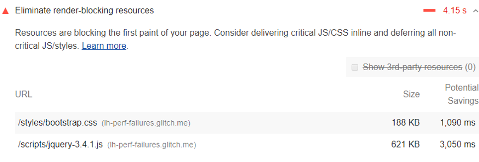

# 删除阻塞渲染的资源

Lighthouse 报告的"优化建议"部分会列出阻止网页首次绘制的所有网址。目标是通过内联关键资源、延迟加载非关键资源以及删除任何未使用的内容来减少这些阻止渲染 URL 的影响。

上图是 Lighthouse 消除阻塞渲染资源的测评截图

## 哪些 URL 被视为阻塞渲染？

Lighthouse 标记了两种类型的阻塞渲染 URL：脚本和样式表。

符合以下条件的 `<script>` 标签：

- 在网页的 `<head>` 标签中
- 没有 `defer` 属性
- 没有 `async` 属性

符合以下条件的 `<link rel="stylesheet">` 标签：

- 没有 `disabled` 属性。当此属性存在时，浏览器不会下载样式表。
- 没有 `media` 属性与用户特定设备匹配。`media="all"` 被视为阻塞渲染。

## 如何识别关键资源

减少渲染阻止资源影响的第一步是确定什么是关键的，什么是不重要的。使用 Chrome DevTools 中的"覆盖范围"选项卡来识别非关键 CSS 和 JS。加载或运行页面时，该选项卡会告诉您使用了多少代码，以及加载了多少代码：

上图为 Chrome DevTools：Coverage 标签

您可以通过仅发布所需的代码和样式来减小页面的大小。单击 URL 以在"源"面板中检查该文件。CSS 文件中的样式和 JavaScript 文件中的代码以两种颜色标记：

绿色（严重）：首次上漆所需的样式;对页面的核心功能至关重要的代码。
红色（非严重）：应用于不立即可见的内容的样式;代码未在页面的核心功能中使用。

## 如何消除阻塞渲染的脚本

确定关键代码后，将该代码从呈现阻止 URL 移动到 HTML 页面中的内联标记。当页面加载时，它将具有处理页面核心功能所需的内容。script

如果呈现阻止 URL 中存在不重要的代码，则可以将其保留在 URL 中，然后将 URL 标记为或属性（另请参阅添加与 JavaScript 的交互性）。asyncdefer

应删除根本不使用的代码（请参阅删除未使用的代码）。

## 如何消除阻塞渲染的样式表

与在标记中内联代码类似，在 HTML 页面的块内进行第一次绘制所需的内联关键样式。然后使用链接异步加载其余样式（请参见推迟未使用的 CSS）。`<script><style>headpreload`

考虑使用关键工具自动执行提取和内联"首屏"CSS 的过程。

Another approach to eliminating render-blocking styles is to split up those styles into different files, organized by media query. Then add a media attribute to each stylesheet link. When loading a page, the browser only blocks the first paint to retrieve the stylesheets that match the user's device (see Render-Blocking CSS).

Finally, you'll want to minify your CSS to remove any extra whitespace or characters (see Minify CSS). This ensures that you're sending the smallest possible bundle to your users.

## 特定技术栈的指导

### AMP

使用 AMP 优化器等工具在服务器端呈现 AMP 布局。

### Drupal

考虑使用模块内联关键 CSS 和 JavaScript，或者可能通过 JavaScript 异步加载资产，例如高级 CSS/JS 聚合模块。

### Joomla

有许多 Joomla 插件可以帮助您内联关键资产或推迟不太重要的资源。

### WordPress

有许多 WordPress 插件可以帮助您内联关键资产或推迟不太重要的资源。

## 资源

- [消除阻塞渲染资源审计的源代码](https://github.com/GoogleChrome/lighthouse/blob/master/lighthouse-core/audits/byte-efficiency/render-blocking-resources.js)
- [通过代码拆分减少 JavaScript 有效负载](https://web.dev/reduce-javascript-payloads-with-code-splitting)
- [删除未使用的代码](https://web.dev/codelab-remove-unused-code)
- [JavaScript 启动优化](https://developers.google.com/web/fundamentals/performance/optimizing-content-efficiency/javascript-startup-optimization/)
