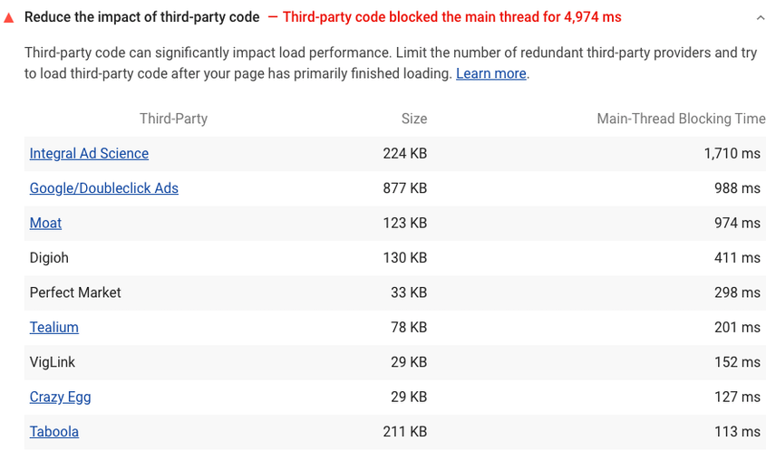

# Reduce the impact of third-party code

To add an advertising network, social media button, A/B test, or analytics service to your page, you usually need to add a third-party script to your HTML. These third-party scripts can significantly affect your page load performance.

## How the Lighthouse audit for third-party code fails

Lighthouse flags pages that have third-party code that blocks the main thread for 250 ms or longer:

A screenshot of the Lighthouse Reduce the impact of third-party code audit
A third-party script is any script hosted on a domain that's different than the domain of the URL that you audited with Lighthouse. As the page loads, Lighthouse calculates how long each of the third-party scripts blocks the main thread. If the total blocking time is greater than 250 ms the audit fails.

## How to reduce the impact of third-party code

See Identify slow third-party scripts to learn how to use Chrome DevTools and other Lighthouse audits to detect problematic third-party code, and see Efficiently load third-party JavaScript for optimization strategies.

## Resources

- [Source code for Reduce the impact of third-party code audit](https://github.com/GoogleChrome/lighthouse/blob/master/lighthouse-core/audits/third-party-summary.js)
- [Loading Third-party JavaScript](https://developers.google.com/web/fundamentals/performance/optimizing-content-efficiency/loading-third-party-javascript/)
