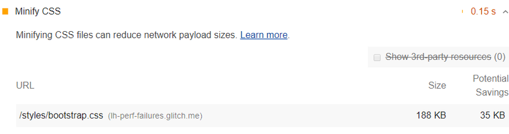

# Minify CSS

The Opportunities section of your Lighthouse report lists all unminified CSS files, along with the potential savings in kibibytes (KiB) when these files are minified:

A screenshot of the Lighthouse Minify CSS audit

## How minifying CSS files can improve performance

Minifying CSS files can improve your page load performance. CSS files are often larger than they need to be. For example:

```css
/* Header background should match brand colors. */
h1 {
  background-color: #000000;
}
h2 {
  background-color: #000000;
}
```

Can be reduced to:

```css
h1, h2 { background-color: #000000; }
```

From the perspective of the browser, these 2 code samples are functionally equivalent, but the second example uses less bytes. Minifiers can further improve byte efficiency by removing whitespace:

```css
h1,h2{background-color:#000000;}
```

Some minifiers employ clever tricks to minimize bytes. For example, the color value #000000 can be further reduced to #000, which is its shorthand equivalent.

Lighthouse provides an estimate of potential savings based on the comments and whitespace characters that it finds in your CSS. This is a conservative estimate. As mentioned earlier, minifiers can perform clever optimizations (such as reducing #000000 to #000) to further reduce your file size. So, if you use a minifier, you may see more savings than what Lighthouse reports.

## Use a CSS minifier to minify your CSS code

For small sites that you don't update often, you can probably use an online service for manually minifying your files. You paste your CSS into the service's UI, and it returns a minified version of the code.

For professional developers, you probably want to set up an automated workflow that minifies your CSS automatically before you deploy your updated code. This is usually accomplished with a build tool like Gulp or Webpack.

Learn how to minify your CSS code in Minify CSS.

## Stack-specific guidance

### Drupal

Enable Aggregate CSS files in Administration > Configuration > Development. You can also configure more advanced aggregation options through additional modules to speed up your site by concatenating, minifying, and compressing your CSS styles.

### Joomla

A number of Joomla extensions can speed up your site by concatenating, minifying, and compressing your css styles. There are also templates that provide this functionality.

### Magento

Enable the Minify CSS Files option in your store's Developer settings.

### React

If your build system minifies CSS files automatically, ensure that you are deploying the production build of your application. You can check this with the React Developer Tools extension.

## WordPress

A number of WordPress plugins can speed up your site by concatenating, minifying, and compressing your styles. You may also want to use a build process to do this minification up-front if possible.

## Resource

- [Source code for Minify CSS audit](https://github.com/GoogleChrome/lighthouse/blob/master/lighthouse-core/audits/byte-efficiency/unminified-css.js)
- [Minify CSS](https://web.dev/minify-css)
- [Minify and compress network payloads](https://web.dev/reduce-network-payloads-using-text-compression)
