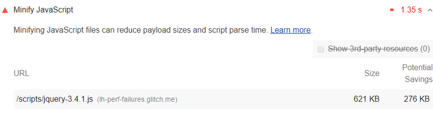

# 压缩 JavaScript

压缩 JavaScript 文件可以减少有效负载大小和脚本解析时间。Lighthouse 报告的“机会”部分列出了所有未压缩的 JavaScript 文件，以及缩小这些文件后可能节省的千字节 (KiB) ：

## 如何压缩 JavaScript 文件

压缩是删除空格和任何无用代码的过程，用来创建一个更小的完全有效的代码文件。Terser 是一种流行的 JavaScript 压缩工具。webpack v4 默认包含这个库的插件来创建压缩的 Javascript 文件。

## Stack-specific guidance

### Drupal

Ensure you have enabled Aggregate JavaScript files in the Administration

Configuration > Development page. You can also configure more advanced aggregation options through additional modules to speed up your site by concatenating, minifying, and compressing your JavaScript assets.

### Joomla

A number of Joomla extensions can speed up your site by concatenating, minifying, and compressing your scripts. There are also templates that provide this functionality.

### Magento

Use Terser to minify all JavaScript assets from static content deployment, and disable the built-in minification feature.

### React

If your build system minifies JS files automatically, ensure that you are deploying the production build of your application. You can check this with the React Developer Tools extension.

### WordPress

A number of WordPress plugins can speed up your site by concatenating, minifying, and compressing your scripts. You may also want to use a build process to do this minification up front if possible.

## 资源

- [审核 JavaScript 是否压缩的源代码](https://github.com/GoogleChrome/lighthouse/blob/master/lighthouse-core/audits/byte-efficiency/unminified-javascript.js)
