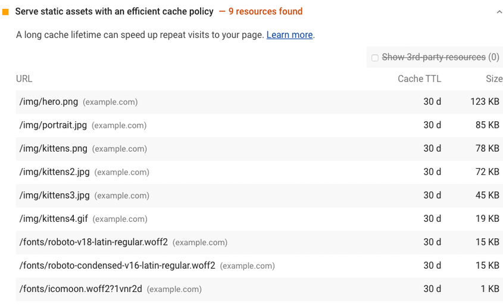
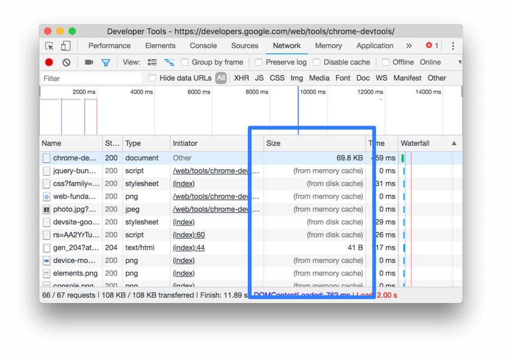
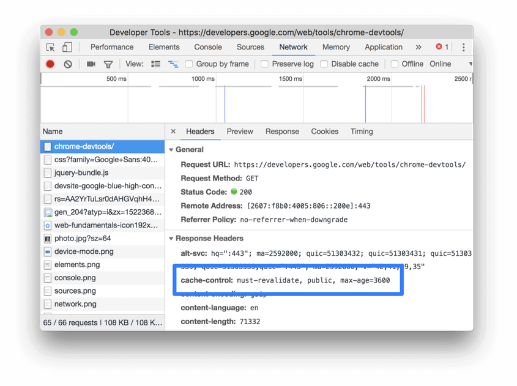

# Serve static assets with an efficient cache policy

HTTP caching can speed up your page load time on repeat visits.

When a browser requests a resource, the server providing the resource can tell the browser how long it should temporarily store or cache the resource. For any subsequent request for that resource, the browser uses its local copy rather than getting it from the network.

## How the Lighthouse cache policy audit fails

Lighthouse flags all static resources that aren't cached:



A screenshot of the Lighthouse Serve static assets with an efficient cache policy audit
Lighthouse considers a resource cacheable if all the following conditions are met:

The resource is a font, image, media file, script, or stylesheet.
The resource has a 200, 203, or 206 HTTP status code.
The resource doesn't have an explicit no-cache policy.
When a page fails the audit, Lighthouse lists the results in a table with three columns:

URL	The location of the cacheable resource
Cache TTL	The current cache duration of the resource
Size	An estimate of the data your users would save if the flagged resource had been cached
See the Lighthouse performance scoring post to learn how your page's overall performance score is calculated.

## How to cache static resources using HTTP caching

Configure your server to return the Cache-Control HTTP response header:

```javascript
Cache-Control: max-age=31536000
```
The max-age directive tells the browser how long it should cache the resource in seconds. This example sets the duration to 31536000, which corresponds to 1 year: 60 seconds × 60 minutes × 24 hours × 365 days = 31536000 seconds.

When possible, cache immutable static assets for a long time, such as a year or longer.

One risk of long cache durations is that your users won't see updates to static files. You can avoid this issue by configuring your build tool to embed a hash in your static asset filenames so that each version is unique, prompting the browser to fetch the new version from the server. (To learn how to embed hashes using webpack, see webpack's Caching guide.)

Use no-cache if the resource changes and freshness matters, but you still want to get some of the speed benefits of caching. The browser still caches a resource that's set to no-cache but checks with the server first to make sure that the resource is still current.

A longer cache duration isn't always better. Ultimately, it's up to you to decide what the optimal cache duration is for your resources.

There are many directives for customizing how the browser caches different resources. Learn more about caching resources in The HTTP cache: your first line of defense guide and Configuring HTTP caching behavior codelab.

## How to verify cached responses in Chrome DevTools

To see which resources the browser is getting from its cache, open the Network tab in Chrome DevTools:

Press `Control+Shift+J` (or `Command+Option+J` on Mac) to open DevTools.
Click the Network tab.
The Size column in Chrome DevTools can help you verify that a resource has been cached:



The Size column.
Chrome serves the most requested resources from the memory cache, which is very fast, but is cleared when the browser is closed.

To verify a resource's Cache-Control header is set as expected, check its HTTP header data:

Click the URL of the request, under the Name column of the Requests table.
Click the Headers tab.




##Stack-specific guidance

### Drupal

Set the Browser and proxy cache maximum age in the Administration > Configuration > Development page. See Drupal performance resources.

### Joomla

See Cache.

### WordPress

See Browser Caching.

## Resources

- [Source code for Serve static assets with an efficient cache policy audit](https://github.com/GoogleChrome/lighthouse/blob/master/lighthouse-core/audits/byte-efficiency/uses-long-cache-ttl.js)
- [Cache-Control specification](https://www.w3.org/Protocols/rfc2616/rfc2616-sec14.html#sec14.9)
- [Cache-Control (MDN)](https://developer.mozilla.org/docs/Web/HTTP/Headers/Cache-Control)
