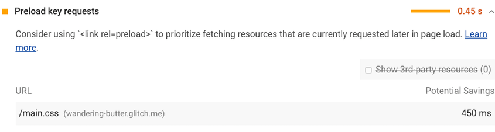
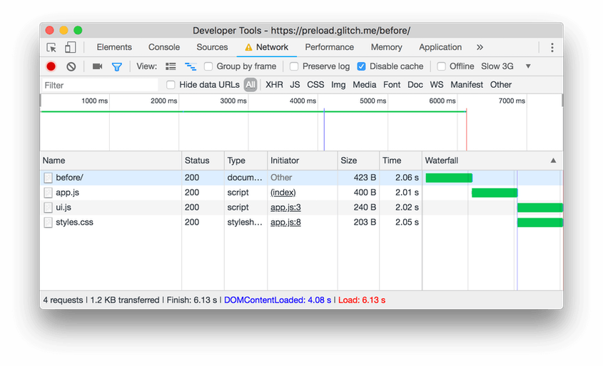

# Preload key requests

The Opportunities section of your Lighthouse report flags the third level of requests in your critical request chain as preload candidates:



A screenshot of the Lighthouse Preload key requests audit

## How Lighthouse flags determines preload candidates

Suppose your page's critical request chain looks like this:

index.html
|--app.js
   |--styles.css
   |--ui.js

Your index.html file declares `<script src="app.js">`. When app.js runs , it calls fetch() in order to download styles.css and ui.js. The page doesn't appear complete until those last 2 resources are downloaded, parsed, and executed. Using the example above, Lighthouse would flag styles.css and ui.js as candidates.

The potential savings are based on how much earlier the browser would be able to start the requests if you declared preload links. For example, if app.js takes 200ms to download, parse, and execute, the potential savings for each resource is 200ms since app.js is no longer a bottleneck for each of the requests.

Preloading requests can make your pages load faster



Without preload links, styles.css and ui.js are requested only after app.js has been downloaded, parsed, and executed.
Without preload links, styles.css and ui.js are requested only after app.js has been downloaded, parsed, and executed.
The problem here is that the browser only becomes aware of those last 2 resources after it downloads, parses, and executes app.js. But you know that those resources are important and should be downloaded as soon as possible.

## Declare your preload links

Declare preload links in your HTML to instruct the browser to download key resources as soon as possible.

```html
<head>
  ...
  <link rel="preload" href="styles.css" as="style">
  <link rel="preload" href="ui.js" as="script">
  ...
</head>
```


With preload links, styles.css and ui.js are requested at the same time as app.js.
With preload links, styles.css and ui.js are requested at the same time as app.js.
See also Preload critical assets to improve loading speed for more guidance.

## Browser compatibility

As of June 2020 preloading is supported in Chromium-based browsers. See Browser compatibility for updates.

## Build tool support for preloading

See Tooling.Report's Preloading Assets page.

## Stack-specific guidance

### Angular
Preload key requests
Preload routes ahead of time to speed up navigation.

### Magento

Modify your themes's layout and add <link rel=preload> tags.

## Resources

- [Source code for Preload key requests audit](https://github.com/GoogleChrome/lighthouse/blob/master/lighthouse-core/audits/uses-rel-preload.js)
