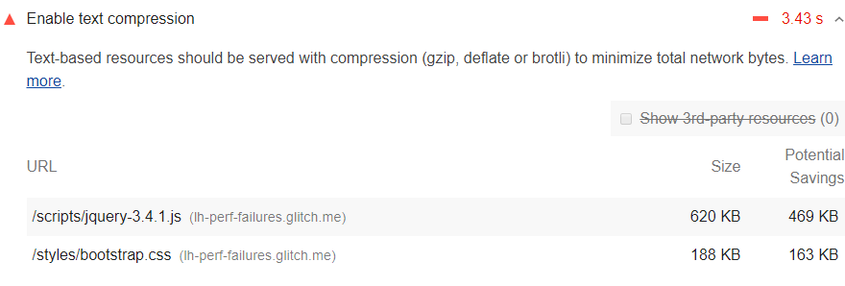

# 启用文本压缩

基于文本的资源应进行压缩，以尽量减少网络总字节数。Lighthouse 报告的 Opportunities 部分列出了所有未压缩的基于文本的资源：

## Lighthouse 如何处理文本压缩

Lighthouse 收集的所有响应都：

具有基于文本的资源类型。
不包括设置为 br、gzip 或 deflate 的 content-encoding 标头。
Lighthouse 随后使用 GZIP 压缩每个响应以计算可能节省的字节数。

如果某个响应的原始大小小于 1.4KiB，或者可能节省的字节数小于原始大小的 10%，则 Lighthouse 不会在结果中标记该响应。

Lighthouse 列出的是在使用 GZIP 对响应进行编码的情况下可能节省的字节数。如果使用 Brotli，则可能节省更多。

## 如何在服务器上启用文本压缩

在提供这些响应的服务器上启用文本压缩以通过此审计。

当浏览器请求资源时，它将使用 Accept-Encoding HTTP 请求标头来指示它支持哪些压缩算法。

Accept-Encoding: gzip, compress
如果浏览器支持 Brotli (br) 您应该使用 Brotli，因为它比其他压缩算法更能减少资源的文件大小。搜索 how to enable Brotli compression in <X>，其中 <X> 是您的服务器的名称。截至 2020 年 6 月，除 Internet Explorer、Safari 桌面版和 iOS 上的 Safari 外，所有主流浏览器都已支持 Brotli。请参阅浏览器兼容性了解更新。

将 GZIP 用作 Brotli 的后备。所有主流浏览器都支持 GZIP，但效率不如 Brotli。有关示例，请参阅服务器配置。

您的服务器应返回 Content-Encoding HTTP 响应标头以指示它使用的压缩算法。

Content-Encoding: br

## 在 Chrome DevTools 中检查响应是否被压缩

要检查服务器是否压缩了响应：

Press `Control+Shift+J` (or `Command+Option+J` on Mac) to open DevTools.

Click the Network tab.

点击引起您感兴趣的响应的请求。

点击 Headers 选项卡。

检查 Response Headers 部分中的 content-encoding 标头。

要比较响应的压缩和解压缩大小：

Press `Control+Shift+J` (or `Command+Option+J` on Mac) to open DevTools.

Click the Network tab.

启用大请求行。请参阅使用大请求行。

查看您感兴趣的响应的 Size 列。上面的值是压缩大小，下面的值是解压缩大小。

另请参阅缩小和压缩网络有效负载。

## 程序栈特定的指南

### Joomla

启用 Gzip 页面压缩设置 (System > Global configuration > Server)。

### WordPress

在 Web 服务器配置中启用文本压缩。

## 资源

- [启用文本压缩审计的源代码](https://github.com/GoogleChrome/lighthouse/blob/master/lighthouse-core/audits/byte-efficiency/uses-text-compression.js)
