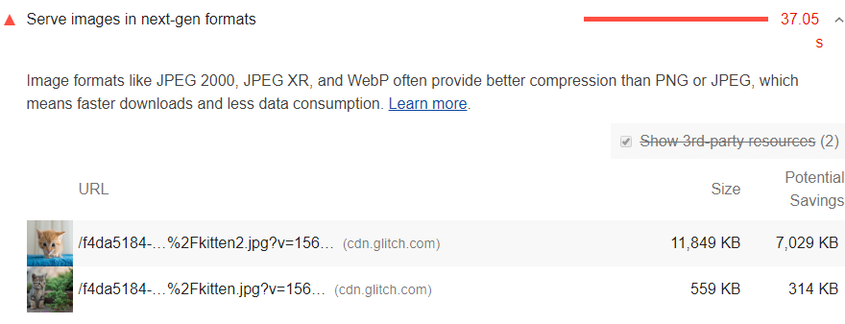

# Serve images in modern formats

The Opportunities section of your Lighthouse report lists all images in older image formats, showing potential savings gained by serving AVIF versions of those images:

A screenshot of the Lighthouse Serve images in modern formats audit

## Why serve images in AVIF or WebP format?

AVIF and WebP are image formats that have superior compression and quality characteristics compared to their older JPEG and PNG counterparts. Encoding your images in these formats rather than JPEG or PNG means that they will load faster and consume less cellular data.

AVIF is supported in Chrome, Firefox, and Opera and offers smaller file sizes compared to other formats with the same quality settings. See Serving AVIF Images Codelab for more on AVIF.

WebP is supported in the latest versions of Chrome, Firefox, Safari, Edge, and Opera and provides better lossy and lossless compression for images on the web. See A New Image Format For The Web for more on WebP.

Try it

Create WebP Images with the Command Line

## How Lighthouse calculates potential savings

Lighthouse collects each BMP, JPEG, and PNG image on the page, converts each to WebP, and estimates the AVIF file size, reporting the potential savings based on the conversion figures.

Lighthouse omits the image from its report if the potential savings are less than 8KiB.

##Browser compatibility

WebP is supported by the latest versions of Chrome, Firefox, Safari, Edge, and Opera, while AVIF support is more limited. You'll need to serve a fallback PNG or JPEG image for older browser support. See How can I detect browser support for WebP? for an overview of fallback techniques and the list below for browser support of image formats.

To see the current browser support for each modern format, check out the entries below:

AVIF
WebP

## Stack-specific guidance

### AMP

Consider displaying all amp-img components in WebP formats while specifying an appropriate fallback for other browsers.

### Drupal

Consider installing and configuring a module to leverage WebP image formats in your site. Such modules automatically generate a WebP version of your uploaded images to optimize loading times.

### oomla

Consider using a plugin or service that will automatically convert your uploaded images to the optimal formats.

### Magento

Consider searching the Magento Marketplace for a variety of third-party extensions to leverage newer image formats.

### WordPress

Consider using a plugin or service that will automatically convert your uploaded images to the optimal formats.

## Resources
- [Source code for Serve images in modern formats audit](https://github.com/GoogleChrome/lighthouse/blob/master/lighthouse-core/audits/byte-efficiency/modern-image-formats.js)
- [Use WebP images](https://web.dev/serve-images-webp)
